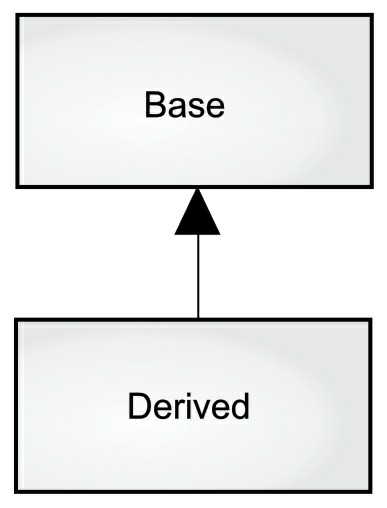

# 概述

计算机革命的起源来自机器，编程语言就像是那台机器。


编程语言就是创建应用程序的思想结构。


**面向对象编程（Object Oriented Programming OOP）是一种编程思维方式和编码架构。**


# 抽象

**从某种程度上来说，问题的复杂度直接取决于抽象的类型^1^和质量。**

[1]	类型：抽象的内容。


OOP 允许我们根据问题来描述问题，而不是根据运行解决方案的计算机。它仍然与计算机有联系，每个对象都类似一台小计算机：它们有自己的状态并且可以进行特定的操作（==它们都有自己的特征和行为==）。


**“纯粹”的面向对象程序设计方法：**

>1. **万物皆对象。**你可以将对象想象成一种特殊的变量。它存储数据，但可以在你对其 **发出请求** 时执行本身的操作。理论上讲，你总是可以从要解决的问题身上抽象出概念性的组件，然后在程序中将其表示为一个对象。
>2. **程序是一组对象，通过消息传递来告知彼此该做什么。**要请求调用一个对象的方法，你需要向该对象发送消息。
>3. **每个对象都有自己的存储空间，可容纳其他对象。**或者说，通过封装现有对象，可制作出新型对象。所以，尽管对象的概念非常简单，但在程序中却可达到任意高的复杂程度。
>4. **每个对象都有一种类型。**根据语法，每个对象都是某个 **类** 的一个 **实例**。其中，**类（Class）** 是 **类型（Type）** 的同义词。一个类最重要的特征就是“能将什么消息发送给它？”。
>5. **同一类所有对象都能接收相同的消息。**这实际是别有含义的一种说法，大家不久便能理解。由于类型为 **圆（Circle）** 的一个对象也属于类型为 **形状（Shape）** 的一个对象，所以一个圆完全能接收发送给 **形状** 的消息。这意味着可让程序代码统一指挥 **形状**，令其自动控制所有符合 **形状** 描述的对象，其中自然包括 **圆**。这一特性称为对象的 **可替换性**，是 OOP 最重要的概念之一。


**对对象更简洁的描述：**

==一个对象具有自己的状态，行为和标识。这意味着对象有自己的内部数据（提供状态）、方法（产生行为），并彼此区分（每个对象在内存中都有唯一的地址）。==


# 接口

**所有对象都是唯一的，但同时也是具有相同的特性和行为的对象所归属的类的一部分。**


创建好一个类后，可根据情况生成许多对象。随后，可将那些对象作为要解决问题中存在的元素进行处理。事实上，当我们进行面向对象的程序设计时，面临的最大一项挑战是：==如何在“问题空间”（问题实际存在的地方）的元素与“方案空间”（对实际问题进行建模的地方，如计算机）的元素之间建立理想的“一对一”映射关系。==


**我们向对象发出的请求是通过它的“接口”（Interface）定义的，对象的“类型”或“类“则规定了它的接口形式。==”类型“与”接口“的对应关系是面向对象程序设计的基础==。**


# 服务提供

**在开发或理解程序设计时，我们可以将对象看成是”服务提供者“。你的程序本身将为用户提供服务，并且它能通过调用其他对象提供的服务来实现这一点。**


==软件设计的基本原则是高内聚：每个组件的内部作用明确，功能紧密相关。==


==在良好的面向对象设计中，每个对象功能单一且高效。这样的程序设计可以提高我们代码的复用性，同时也方便别人阅读和理解我们的代码。==


# 封装

我们可以把编程的侧重领域划分为 ==研发和应用==。应用程序员调用研发程序员构建的基础工具类来做快速开发。研发程序员开发一个工具类，该工具类仅向应用程序员 ==公开必要的内容，并隐藏内部实现的细节==。**这样可以有效地避免该工具类被错误的使用和更改，从而减少程序出错的可能。**如果工具类的创建者将类的内部所有信息都公开给调用者，那么有些使用规则就不容易被遵守。因为前者无法保证后者是否会按照正确的规则来使用，甚至是改变该工具类。只有 ==设定访问控制==，才能从根本上阻止这种情况的发生。


**使用访问控制的原因：**

1. 让应用程序员不要触摸他们不应该触摸的部分。
2. 使类库的创建者（研发程序员）在不影响后者使用的情况下完善更新工具库。


Java 有 ==三个显式关键字== 来设置类中的访问权限：==public（公开）==，==private（私有）==，和 ==protected（受保护）==。这些访问修饰符决定了谁能使用它们修饰的 ==方法、变量或类==。

1. **public（公开）**：表示任何人都可以访问和使用该元素；
2. **private（私有）**：除了类本身和类内部的方法，外界无法直接访问该元素。`private` 是类和调用者之间的屏障。任何试图访问私有成员的行为都会报编译时错误；
3. **protected（受保护）**：类似于 `private`，区别是子类可以访问 `protected` 的成员，但不能访问 `private` 成员；
4. **default（默认）**：如果你不使用前三者，默认就是 `default` 访问权限。`default` 被称为包访问，因为该权限下的资源可以被同一包（库组件）中其他类的成员访问。


# 复用

==一个类经创建和测试后，理应是可复用的。==


**代码和设计方案的复用性是面向对象程序设计的优点之一。**==我们可以通过重复使用某个类的对象来达到这种复用性。同时，我们也可以将一个类的对象作为另一个类的成员变量使用。新的类可以是由任意数量和任意类型的其他对象构成。==这里涉及到 **组合** 和 **聚合** 的概念：

- **组合（Composition）**：经常用来表示”拥有“关系（has-a relationship）。
- **聚合（Aggregation）**：动态的组合。


上图中实心三角形指向 `Car` 表示 **组合** 的关系；如果是 **聚合** 关系，可以使用空心三角形。

>注：**组合** 和 **聚合** 都属于关联关系的一种，只是额外具有 **整体-部分** 的意义。具体是哪一种关系，只能从语义级别来区分。
>
>1. **聚合** 关系中，整件不会拥有部件的生命周期，所以整件删除时，部件不会被删除。再者，多个整件可以共享同一个部件；
>2. **组合** 关系中，整件拥有部件的生命周期，所以整件删除时，部件一定会跟着删除。而且，多个整件不可以同时共享同一个部件。
>
>==两个类生命周期不同步，则是 **聚合** 关系，生命周期同步就是 **组合** 关系。==


在创建新类时首先要考虑 **组合** 而不是 **继承**，因为它更简单灵活，而且设计更加清晰。


# 继承

”对象“的概念给编程带来便利。它在概念上允许我们将各式各样的数据和功能封装到一起，这样便可恰当表达”问题空间“的概念，而不用受制于必须使用底层机器语言。


**在继承过程中，若基类（又称超类或父类）发生了变化，修改过的派生类（又称继承类或子类）也会反映出这种变化。**



这个图中的箭头从派生类指向基类，通常有多个派生类。

**类型不仅仅描述一组对象的约束，它还涉及其他类型。两种类型可以具有共同的特征和行为，但是一种类型可能包含比另一种类型更多的特征，并且还可以处理更多的消息（或者以不同的方式处理它们）。**继承通过基类和派生类的概念来表达这种相似性。==基类包含派生自它的类型之间共享的所有特征和行为。==**创建基类以表示思想的核心，从基类中派生出其他类型来表示实现该核心的不同方式。**


**派生类不仅包含基类的所有成员（尽管私有成员被隐藏起来并且不可访问），更重要的是它复制了基类的接口。**==基类对象接收的所有消息也能被派生类对象接收。==根据类接收的消息，我们知道类的类型，因此 ==派生类与基类是相同的类型==。


**区分原始的基类与新的派生类的两种方法：**

1. 在派生类中添加新方法。
2. 改变现有基类的方法（覆盖 overriding），即在派生类中重新定义该方法。


> 1. **替代原则（纯粹替代）**：==用一个派生类对象完全替代基类对象。==这种关系称为 **是一个（is-a）** 关系。
>
> 2. 在派生类添加新的接口元素，从而扩展接口。虽然新类型仍然可以替代基类，但是这种替代不完美，原因在于 ==基类无法访问新添加的方法==。这种关系称为 **像是一个（is-like-a）** 关系。新类型不但拥有旧类型的接口，而且包含其他方法，所以不能说新旧类型完全相同。


# 多态

==在处理类的层次结构时，通常把一个对象看成是它所属的基类，而不是把它当成具体类。==通过这种方式，我们可以编写出不局限于特定类型的代码。==通过派生新的子类来扩展设计的这种能力是封装变化的基本方法之一。==


**在调用 `move()` 方法时如何保证正确的行为？**

由非 OOP 编译器产生的函数调用会引起所谓的 **早期绑定**，这意味着编译器生成对特定函数名的调用，该调用会被解析为将执行的代码的绝对地址。

通过继承，==程序直到运行时才能确定代码的地址==，面向对象语言使用 **后期绑定** 的概念。当向对象发送信息时，被调用的代码直到运行时才确定。==编译器确保方法存在，并对参数和返回值执行类型检查，但是它不知道要执行的确切代码。==

==为了执行 **后期绑定**，Java 使用一个特殊的代码位来代替绝对调用。这段代码使用对象中存储的信息来计算方法主体的地址。因此，每个对象的行为根据特定代码位的内容而不同==。**当你向对象发送消息时，对象知道该如何处理这条消息**。在 Java 中，==动态绑定是默认行为==，不需要额外的关键字来实现多态性。


**代码示例：**

```java
    public void doSomething(Shape shape) {
        shape.erase();
        shape.draw();
    }
```

此方法与任何 **Shape** 对话，因此 ==它与所绘制和擦除的对象的具体类型无关==。如果程序的其他部分使用 `doSomething()` 方法：

```java
        DoSomething doSomething = new DoSomething();
        Circle circle = new Circle();
        Line line = new Line();
        Triangle triangle = new Triangle();

        doSomething.doSomething(circle);
        doSomething.doSomething(line);
        doSomething.doSomething(triangle);
```

可以看到无论传入的 **Shape** 是什么，程序都正确的执行。


分析下面这行代码：

```java
doSomething(circle);
```

当预期接收 **Shape** 的方法被传入了 **Circle**，由于 **Circle** 也是一种 **Shape**，所以 `doSomething(circle)` 能正确的执行，也就是说 `doSomething()` 能接受任意发送给 **Shape** 的消息，这是完全安全和合乎逻辑的。


==这种把子类当成其基类来处理的过程叫做 **向上转型（upcasting）**==。在面向对象的编程里，经常利用这种方法来给程序解耦。

>**向上转型**：子转父。
>
>**向下转型**：父转子。


==发送消息给对象时，如果程序不知道接收的具体类型是什么，但最终执行是正确的，这就是对象的 **多态性（Polymorphism）**。==


==面向对象的程序设计语言是通过 **动态绑定** 的方式来实现对象的多态性的，编译器和运行时系统会负责对所有细节的控制。==


>**Java 两种绑定：**
>
>- 静态绑定（前期绑定）：只有 `final`、`static`、`private` 和 `构造方法`。
>
>- 动态绑定（后期绑定）：
>    - JVM 寻找对象实际类型的方法表；
>    - JVM 搜索方法签名；
>    - 调用方法。


# 单继承结构

==在 Java 中，所有的类都应该默认从一个基类继承。这个最终基类的名字就是 `Object`。==


**单继承的结构使得垃圾收集器的实现更为容易。**


由于运行期的类型信息会存在于所有对象中，所以我们 **永远不会遇到判断不了对象类型的情况**。这对于系统级操作尤其重要，例如 **异常处理**。同时，这也让我们的 **编程具有更大的灵活性**。


# 集合

==**集合（Collection）** 这种类型的对象可以存储任意类型、数量的其他对象。它能根据需要自动扩容，我们不用关心过程是如何实现的。==


**选择集合的原因：**

1. **集合可以提供不同类型的接口和外部行为。**
2. **不同的集合对某些操作有不同的效率。**


我们可以一开始使用 `LinkedList` 构建程序，在优化系统性能时改用 `ArrayList`。通过对 `List` 接口的抽象，我们可以很容易地将 `LinkedList` 改为 `ArrayList`。


**参数化类型机制（Parameterized Type Mechanism）**：创建集合时确认保存元素的具体类型，减少集合元素 **向下转型** 的开销和可能出现的错误。

>- 参数化类型机制可以使得编译器自动识别某个 `class` 的具体类型并正确地执行。
>- `Java 5` 版本支持了 **参数化类型机制**，称之为 **泛型（Generic）**，是 `Java 5` 的主要特性之一。


# 对象创建与生命周期

==使用对象时要注意的一个关键问题就是 **对象的创建和销毁方式**。==


**两种方式：**

1. 将对象放在 **栈（Stack，有时称为自动变量或作用域变量）** 或 **静态存储区域（static storage area）**中来确定内存占用和生存时间，这些区域的对象会被优先分配内存和释放。
2. 在 **堆内存（Heap）** 中动态地创建对象。在这种方式下，==直到程序运行我们才能确定需要创建的对象数量、生存时间和类型==。什么时候需要，什么时候在堆内存中创建。*因为内存的占用是动态管理的，所以在运行时，在堆内存上开辟空间所需的时间可能比在栈内存上要长（但也不一定）。在栈内存开辟和释放空间通常是一条将栈指针向下移动和一条将栈指针向上移动的汇编命令。*==开辟堆内存空间的时间取决于内存机制的设计==。

>- 在栈内存中创建对象，编译器能够确定该对象的生命周期并自动销毁它；
>- 在堆内存中创建对象，编译器不能确定该对象的生命周期。


**动态方法有这样一个合理假设：**==对象通常是复杂的，相比于对象创建的整体开销，寻找和释放内存空间的开销微不足道==。


==Java 使用动态内存分配。每次创建对象时，使用 `new` 关键字构建该对象的动态实例。==


==Java 的内存管理建立在 **垃圾收集器** 上，它能自动发现对象不再被使用并释放内存。==

>**垃圾收集器** 减少了我们之前必须要跟踪的问题和编写相关代码的数量。因此 **垃圾收集器** 提供了更高级别的保险，以防止潜在的内存泄露问题。


# 异常处理

==异常处理机制将程序错误直接交给编程语言甚至是操作系统。==


**异常（Exception）** 是一个从出错点 **抛出（thrown）** 后能被特定类型的异常处理程序 **捕获（catch）** 的一个对象。它不会干扰程序的正常运行，仅当程序出错的时候才被执行。

>异常不像方法返回的错误和方法设置用来表示发生错误的标志位那样可以被忽略。==异常的发生是不会被忽略的，它终究会在某一时刻被处理==。


**异常机制** 提供了一种可靠地从错误状况中恢复的方法，使得我们可以编写出更健壮的程序。

>异常处理不是面向对象的特性。


==Java 异常处理机制是 Java 语言唯一接受的错误报告方法。==

