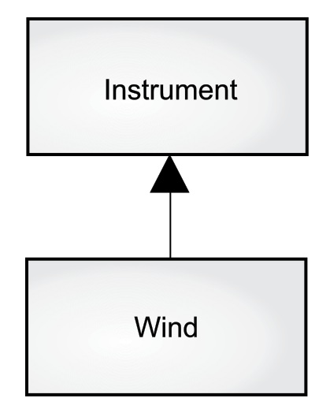

> 代码复用是面向对象编程（OOP）最具魅力的原因之一。


如何在不污染源代码的前提下使用现存代码：

1. ==**组合：**在新类中创建现有类的对象。通过这种方式复用代码的功能，而非其形式。==
2. ==**继承：**创建现有类类型的新类。==


# 组合语法

**代码示例：**

```java
// reuse/SprinklerSystem.java
// (c)2017 MindView LLC: see Copyright.txt
// We make no guarantees that this code is fit for any purpose.
// Visit http://OnJava8.com for more book information.
// Composition for code reuse

class WaterSource {
  private String s;
  WaterSource() {
    System.out.println("WaterSource()");
    s = "Constructed";
  }
  @Override
  public String toString() { return s; }
}

public class SprinklerSystem {
  private String valve1, valve2, valve3, valve4;
  private WaterSource source = new WaterSource();
  private int i;
  private float f;
  @Override
  public String toString() {
    return
      "valve1 = " + valve1 + " " +
      "valve2 = " + valve2 + " " +
      "valve3 = " + valve3 + " " +
      "valve4 = " + valve4 + "\n" +
      "i = " + i + " " + "f = " + f + " " +
      "source = " + source; // [1]
  }
  public static void main(String[] args) {
    SprinklerSystem sprinklers = new SprinklerSystem();
    System.out.println(sprinklers);
  }
}
/* Output:
WaterSource()
valve1 = null valve2 = null valve3 = null valve4 = null
i = 0 f = 0.0 source = Constructed
*/
```

**每个非基本类型对象都有一个 `toString()` 方法。**


==编译器不会为每个引用创建一个默认对象，否则会导致不必要的开销。==


==**初始化引用的 4 种方法：**==

1. 当对象被定义时。（总是在调用构造函数之前初始化）
2. 在该类的构造函数中。
3. 在实际使用对象之前。（这通常被称为 **延迟初始化**，在对象创建开销大且不需要每次都创建对象的情况下，它可以减少开销）
4. 使用实例初始化。

**代码实例：**

```java
// reuse/Bath.java
// (c)2017 MindView LLC: see Copyright.txt
// We make no guarantees that this code is fit for any purpose.
// Visit http://OnJava8.com for more book information.
// Constructor initialization with composition

class Soap {
  private String s;
  Soap() {
    System.out.println("Soap()");
    s = "Constructed";
  }
  @Override
  public String toString() { return s; }
}

public class Bath {
  private String // Initializing at point of definition:
    s1 = "Happy",
    s2 = "Happy",
    s3, s4;
  private Soap castille;
  private int i;
  private float toy;
  public Bath() {
    System.out.println("Inside Bath()");
    s3 = "Joy";
    toy = 3.14f;
    castille = new Soap();
  }
  // Instance initialization:
  { i = 47; }
  @Override
  public String toString() {
    if(s4 == null) // Delayed initialization:
      s4 = "Joy";
    return
      "s1 = " + s1 + "\n" +
      "s2 = " + s2 + "\n" +
      "s3 = " + s3 + "\n" +
      "s4 = " + s4 + "\n" +
      "i = " + i + "\n" +
      "toy = " + toy + "\n" +
      "castille = " + castille;
  }
  public static void main(String[] args) {
    Bath b = new Bath();
    System.out.println(b);
  }
}
/* Output:
Inside Bath()
Soap()
s1 = Happy
s2 = Happy
s3 = Joy
s4 = Joy
i = 47
toy = 3.14
castille = Constructed
*/
```

- 在 **Bath** 构造函数中，有一个代码块 `{i = 47;}` 在所有初始化发生前就已经执行了。

- 当调用 `toString()` 时，它将赋值 **s4**，以便在使用字段的时候所有的属性已被初始化。


# 继承语法

==继承是所有面向对象的一个组成部分。==

> 在创建类时总是要继承，除非显式地继承其他类，否则就隐式地继承 Java 的标准基类对象（Object）。


**代码示例：**

```java
// reuse/Detergent.java
// (c)2017 MindView LLC: see Copyright.txt
// We make no guarantees that this code is fit for any purpose.
// Visit http://OnJava8.com for more book information.
// Inheritance syntax & properties

class Cleanser {
  private String s = "Cleanser";
  public void append(String a) { s += a; }
  public void dilute() { append(" dilute()"); }
  public void apply() { append(" apply()"); }
  public void scrub() { append(" scrub()"); }
  @Override
  public String toString() { return s; }
  public static void main(String[] args) {
    Cleanser x = new Cleanser();
    x.dilute(); x.apply(); x.scrub();
    System.out.println(x);
  }
}

public class Detergent extends Cleanser {
  // Change a method:
  @Override
  public void scrub() {
    append(" Detergent.scrub()");
    super.scrub(); // Call base-class version
  }
  // Add methods to the interface:
  public void foam() { append(" foam()"); }
  // Test the new class:
  public static void main(String[] args) {
    Detergent x = new Detergent();
    x.dilute();
    x.apply();
    x.scrub();
    x.foam();
    System.out.println(x);
    System.out.println("Testing base class:");
    Cleanser.main(args);
  }
}
/* Output:
Cleanser dilute() apply() Detergent.scrub() scrub() foam()
Testing base class:
Cleanser dilute() apply() scrub()
*/
```

- **为了允许继承，一般规则是所有字段为私有，所有方法为公共。**
- `scrub()` 内部不能简单地调用 `scrub()`，因为这会产生递归调用。为了解决这个问题，Java 的 **super** 关键字引用了当前类继承的 **超类（基类）**。
- **继承时，不受限于使用基类的方法，可以向派生类添加任何新方法。**


## 初始化基类

==继承并不只是复制基类的接口，当你创建派生类的对象时，它包含基类的子对象。==

> 这个子对象与你自己创建基类的对象是一样的，只是被包装在派生类的对象中。


==只有一种方法可以保证正确初始化基类子对象：通过调用基类构造函数在构造函数中执行初始化。==

> 该构造函数具有执行基类初始化所需的所有适当信息和特权，Java 自动在派生类构造函数中插入对基类构造函数的调用。


**三个层次的继承：**

```java
// reuse/Cartoon.java
// (c)2017 MindView LLC: see Copyright.txt
// We make no guarantees that this code is fit for any purpose.
// Visit http://OnJava8.com for more book information.
// Constructor calls during inheritance

class Art {
  Art() {
    System.out.println("Art constructor");
  }
}

class Drawing extends Art {
  Drawing() {
    System.out.println("Drawing constructor");
  }
}

public class Cartoon extends Drawing {
  public Cartoon() {
    System.out.println("Cartoon constructor");
  }
  public static void main(String[] args) {
    Cartoon x = new Cartoon();
  }
}
/* Output:
Art constructor
Drawing constructor
Cartoon constructor
*/
```

==构造从基类 ”向外“ 进行，因此基类在派生类构造函数能够访问它之前进行初始化。即使不为 **Cartoon** 创建构造函数，编译器也会默认合成一个无参构造函数，调用基类构造函数。==

**代码示例：**

```java
// reuse/Cartoon.java
// (c)2017 MindView LLC: see Copyright.txt
// We make no guarantees that this code is fit for any purpose.
// Visit http://OnJava8.com for more book information.
// Constructor calls during inheritance

class Art {
  Art() {
    System.out.println("Art constructor");
  }
}

class Drawing extends Art {
  Drawing() {
    System.out.println("Drawing constructor");
  }
}

public class Cartoon extends Drawing {
//  public Cartoon() {
//    System.out.println("Cartoon constructor");
//  }
  public static void main(String[] args) {
    Cartoon x = new Cartoon();
  }
}
/* Output:
Art constructor
Drawing constructor
*/
```


## 带参数的构造函数

==如果没有无参数的构造函数，或者必须调用具有参数的基类构造函数，则必须使用 **super** 关键字和适当的参数列表显式地编写对基类构造函数的调用。==

**代码示例：**

```java
// reuse/Chess.java
// (c)2017 MindView LLC: see Copyright.txt
// We make no guarantees that this code is fit for any purpose.
// Visit http://OnJava8.com for more book information.
// Inheritance, constructors and arguments

class Game {
  Game(int i) {
    System.out.println("Game constructor");
  }
}

class BoardGame extends Game {
  BoardGame(int i) {
    super(i);
    System.out.println("BoardGame constructor");
  }
}

public class Chess extends BoardGame {
  Chess() {
    super(11);
    System.out.println("Chess constructor");
  }
  public static void main(String[] args) {
    Chess x = new Chess();
  }
}
/* Output:
Game constructor
BoardGame constructor
Chess constructor
*/
```

如果没有在 **BoardGame** 构造函数中调用基类构造函数，编译器就会报错找不到 `Game()` 的构造函数。


==对基类构造函数的调用必须是派生类构造函数中的第一个操作。==


# 委托

==Java 不直接支持的第三种重用关系称为委托。==

> 介于继承和组合之间，因为你将一个成员对象放在正在构建的类中（比如组合），但同时又在新类中公开来自成员对象的所有方法（比如继承）。

**例如，宇宙飞船需要一个控制模块：**

```java
// reuse/SpaceShipControls.java
// (c)2017 MindView LLC: see Copyright.txt
// We make no guarantees that this code is fit for any purpose.
// Visit http://OnJava8.com for more book information.

public class SpaceShipControls {
  void up(int velocity) {}
  void down(int velocity) {}
  void left(int velocity) {}
  void right(int velocity) {}
  void forward(int velocity) {}
  void back(int velocity) {}
  void turboBoost() {}
}
```

**建造宇宙飞船的第一个方法是用继承：**

```java
// reuse/DerivedSpaceShip.java
// (c)2017 MindView LLC: see Copyright.txt
// We make no guarantees that this code is fit for any purpose.
// Visit http://OnJava8.com for more book information.

public class DerivedSpaceShip extends SpaceShipControls {
  private String name;
  public DerivedSpaceShip(String name) {
    this.name = name;
  }
  @Override
  public String toString() { return name; }
  public static void main(String[] args) {
    DerivedSpaceShip protector =
        new DerivedSpaceShip("NSEA Protector");
    protector.forward(100);
  }
}
```

然而，**DerivedSpaceShip** 并不是真正的 “一种” **SpaceShipControls**，即使你 “告诉“ **DerivedSpaceShip** 调用 `forward()`。更准确地说，一艘宇宙飞船包含了 **SpaceShipControls**，同时 **SpaceShipControls** 中的所有方法都暴露在宇宙飞船中。

**委托** 解决了这个难题：

```java
// reuse/SpaceShipDelegation.java
// (c)2017 MindView LLC: see Copyright.txt
// We make no guarantees that this code is fit for any purpose.
// Visit http://OnJava8.com for more book information.

public class SpaceShipDelegation {
  private String name;
  private SpaceShipControls controls =
    new SpaceShipControls();
  public SpaceShipDelegation(String name) {
    this.name = name;
  }
  // Delegated methods:
  public void back(int velocity) {
    controls.back(velocity);
  }
  public void down(int velocity) {
    controls.down(velocity);
  }
  public void forward(int velocity) {
    controls.forward(velocity);
  }
  public void left(int velocity) {
    controls.left(velocity);
  }
  public void right(int velocity) {
    controls.right(velocity);
  }
  public void turboBoost() {
    controls.turboBoost();
  }
  public void up(int velocity) {
    controls.up(velocity);
  }
  public static void main(String[] args) {
    SpaceShipDelegation protector =
      new SpaceShipDelegation("NSEA Protector");
    protector.forward(100);
  }
}
```

方法被转发到底层 **control** 对象，因此接口与继承的接口是相同的。但是，你对委托有更多的控制，因为你可以选择只在成员对象中提供方法的子集。


==Java 不支持委托，但开发工具一般支持，比如 **IntelliJ IDEA**。==

# 结合组合与继承

**使用继承和组合创建类，以及必要的构造函数初始化：**

```java
// reuse/PlaceSetting.java
// (c)2017 MindView LLC: see Copyright.txt
// We make no guarantees that this code is fit for any purpose.
// Visit http://OnJava8.com for more book information.
// Combining composition & inheritance

class Plate {
  Plate(int i) {
    System.out.println("Plate constructor");
  }
}

class DinnerPlate extends Plate {
  DinnerPlate(int i) {
    super(i);
    System.out.println("DinnerPlate constructor");
  }
}

class Utensil {
  Utensil(int i) {
    System.out.println("Utensil constructor");
  }
}

class Spoon extends Utensil {
  Spoon(int i) {
    super(i);
    System.out.println("Spoon constructor");
  }
}

class Fork extends Utensil {
  Fork(int i) {
    super(i);
    System.out.println("Fork constructor");
  }
}

class Knife extends Utensil {
  Knife(int i) {
    super(i);
    System.out.println("Knife constructor");
  }
}

// A cultural way of doing something:
class Custom {
  Custom(int i) {
    System.out.println("Custom constructor");
  }
}

public class PlaceSetting extends Custom {
  private Spoon sp;
  private Fork frk;
  private Knife kn;
  private DinnerPlate pl;
  public PlaceSetting(int i) {
    super(i + 1);
    sp = new Spoon(i + 2);
    frk = new Fork(i + 3);
    kn = new Knife(i + 4);
    pl = new DinnerPlate(i + 5);
    System.out.println("PlaceSetting constructor");
  }
  public static void main(String[] args) {
    PlaceSetting x = new PlaceSetting(9);
  }
}
/* Output:
Custom constructor
Utensil constructor
Spoon constructor
Utensil constructor
Fork constructor
Utensil constructor
Knife constructor
Plate constructor
DinnerPlate constructor
PlaceSetting constructor
*/
```

尽管编译器强制你初始化基类，并要求你在构造函数的开头就初始化基类，但它并不监视你以确保你初始化了成员对象。


## 保证适当的清理

==如果你想为类清理一些东西，必须显式地编写一个特殊的方法来完成它，并确保其他人知道必须调用这个方法——必须通过在 **finally** 子句中放置此类清理来防止异常。==


**一个在屏幕上绘制图片的计算机辅助设计系统的例子：**

```java
// reuse/CADSystem.java
// (c)2017 MindView LLC: see Copyright.txt
// We make no guarantees that this code is fit for any purpose.
// Visit http://OnJava8.com for more book information.
// Ensuring proper cleanup
// {java reuse.CADSystem}
package reuse;

class Shape {
  Shape(int i) {
    System.out.println("Shape constructor");
  }
  void dispose() {
    System.out.println("Shape dispose");
  }
}

class Circle extends Shape {
  Circle(int i) {
    super(i);
    System.out.println("Drawing Circle");
  }
  @Override
  void dispose() {
    System.out.println("Erasing Circle");
    super.dispose();
  }
}

class Triangle extends Shape {
  Triangle(int i) {
    super(i);
    System.out.println("Drawing Triangle");
  }
  @Override
  void dispose() {
    System.out.println("Erasing Triangle");
    super.dispose();
  }
}

class Line extends Shape {
  private int start, end;
  Line(int start, int end) {
    super(start);
    this.start = start;
    this.end = end;
    System.out.println(
      "Drawing Line: " + start + ", " + end);
  }
  @Override
  void dispose() {
    System.out.println(
      "Erasing Line: " + start + ", " + end);
    super.dispose();
  }
}

public class CADSystem extends Shape {
  private Circle c;
  private Triangle t;
  private Line[] lines = new Line[3];
  public CADSystem(int i) {
    super(i + 1);
    for(int j = 0; j < lines.length; j++){
      lines[j] = new Line(j, j*j);
    }
    c = new Circle(1);
    t = new Triangle(1);
    System.out.println("Combined constructor");
  }
  @Override
  public void dispose() {
    System.out.println("CADSystem.dispose()");
    // The order of cleanup is the reverse
    // of the order of initialization:
    t.dispose();
    c.dispose();
    for(int i = lines.length - 1; i >= 0; i--){
      lines[i].dispose();
    }
    super.dispose();
  }
  public static void main(String[] args) {
    CADSystem x = new CADSystem(47);
    try {
      // Code and exception handling...
    } finally {
      x.dispose();
    }
  }
}
/* Output:
Shape constructor
Shape constructor
Drawing Line: 0, 0
Shape constructor
Drawing Line: 1, 1
Shape constructor
Drawing Line: 2, 4
Shape constructor
Drawing Circle
Shape constructor
Drawing Triangle
Combined constructor
CADSystem.dispose()
Erasing Triangle
Shape dispose
Erasing Circle
Shape dispose
Erasing Line: 2, 4
Shape dispose
Erasing Line: 1, 1
Shape dispose
Erasing Line: 0, 0
Shape dispose
Shape dispose
*/
```

- 这个系统中的所有东西都是某种 **Shape**，每个类都有自己的 `dispose()` 方法来将非内存的内容恢复到对象存在之前的状态。
- **finally** 子句的意思是：无论发生什么，始终调用 `x.dispose()`。
- 在清理方法（本例是 `dispose()`）中，必须注意基类和成员对象清理方法的调用顺序，以防一个子对象依赖于另一个子对象。==按与创建相反的顺序来执行特定于类的所有清理工作（一般来说，这要求基类元素仍然是可访问的），然后调用基类清理方法。==
- 如果必须要执行显式清理，使用自己的清理方法，不要使用 `finalize()`。


## 名称隐藏

==如果 Java 基类的方法名多次重载，则在派生类中重新定义该方法名不会隐藏任何基类版本。==不管方法是在这个级别定义的，还是在基类中定义的，重载都会起作用：

```java
// reuse/Hide.java
// (c)2017 MindView LLC: see Copyright.txt
// We make no guarantees that this code is fit for any purpose.
// Visit http://OnJava8.com for more book information.
// Overloading a base-class method name in a derived
// class does not hide the base-class versions

class Homer {
  char doh(char c) {
    System.out.println("doh(char)");
    return 'd';
  }
  float doh(float f) {
    System.out.println("doh(float)");
    return 1.0f;
  }
}

class Milhouse {}

class Bart extends Homer {
  void doh(Milhouse m) {
    System.out.println("doh(Milhouse)");
  }
}

public class Hide {
  public static void main(String[] args) {
    Bart b = new Bart();
    b.doh(1);
    b.doh('x');
    b.doh(1.0f);
    b.doh(new Milhouse());
  }
}
/* Output:
doh(float)
doh(char)
doh(float)
doh(Milhouse)
*/
```

- **Homer** 的所有重载方法在 **Bart** 中都是可用的，尽管 **Bart** 引入了一种新的重载方法。

> 在 Java 1.4 版本以前，重写方法的返回值类型被要求必须与被重写方法一致，但是在 Java 5.0 中放宽了这一限制，添加了对协变返回类型的支持，在重写的时候，==重写方法的返回值类型可以是被重写方法返回值类型的子类==。

- `Override` 注解能防止你意外地重载。


# 组合与继承的选择

==组合和继承都允许在新类中放置子对象（组合是显式地，继承是隐式地）。==


==在新类中包含一个已有类的功能，使用组合。也就是在新类中嵌入一个对象（通常是私有的），以实现其功能。==

> 新类的使用者看到的是你所定义的新类的接口，而非嵌入对象的接口。


**代码示例：**

```java
// reuse/Car.java
// Composition with public objects
class Engine {
    public void start() {}
    public void rev() {}
    public void stop() {}
}

class Wheel {
    public void inflate(int psi) {}
}

class Window {
    public void rollup() {}
    public void rolldown() {}
}

class Door {
    public Window window = new Window();
    
    public void open() {}
    public void close() {}
}

public class Car {
    public Engine engine = new Engine();
    public Wheel[] wheel = new Wheel[4];
    public Door left = new Door(), right = new Door(); // 2-door
    
    public Car() {
        for (int i = 0; i < 4; i++) {
            wheel[i] = new Wheel();
        }
    }
    
    public static void main(String[] args) {
        Car car = new Car();
        car.left.window.rollup();
        car.wheel[0].inflate(72);
    }
}
```

上例中 **car** 的组合也是问题分析的一部分（不是底层设计的部分），所以声明成员为 **public** 有助于其他人理解如何使用类，而且降低了类创建者面临的代码复杂度。但通常来说，属性还是应该声明为 **private**。


==当使用继承时，使用一个现有类并开发出它的新版本，通常这意味着使用一个通用类，为了某个特殊需求将其特殊化。==


==”是一个“ 的关系用继承来表达，”有一个“ 的关系用组合来表达。==


# protected

==对于任何继承它的子类或在同一包中的类，是可访问的。==

> 最好的方式是将属性声明为 **private** 以一直保留更改底层实现的权利，然后通过 **protected** 控制类的继承者的访问权限。


**代码示例：**

```java
// reuse/Orc.java
// The protected keyword
class Villain {
    private String name;
    
    protected void set(String nm) {
        name = nm;
    }
    
    Villain(String name) {
        this.name = name;
    }
    
    @Override
    public String toString() {
        return "I'm a Villain and my name is " + name;
    }
}

public class Orc extends Villain {
    private int orcNumber;
    
    public Orc(String name, int orcNumber) {
        super(name);
        this.orcNumber = orcNumber;
    }
    
    public void change(String name, int orcNumber) {
        set(name); // Available because it's protected
        this.orcNumber = orcNumber;
    }
    
    @Override
    public String toString() {
        return "Orc " + orcNumber + ": " + super.toString();
    }
    
    public static void main(String[] args) {
        Orc orc = new Orc("Limburger", 12);
        System.out.println(orc);
        orc.change("Bob", 19);
        System.out.println(orc);
    }
}
```

输出结果：

```
Orc 12: I'm a Villain and my name is Limburger
Orc 19: I'm a Villain and my name is Bob
```

`change()` 方法可以访问 `set()` 方法，因为 `set()` 方法是 **protected**。类 **Orc** 的 `toString()` 方法也使用了基类的版本。


# 向上转型

==继承最重要的方面不是为新类提供方法，它是新类与基类的一种关系——新类是已有类的一种类型。==


**代码示例：**

```java
// reuse/Wind.java
// Inheritance & upcasting
class Instrument {
    public void play() {}
    
    static void tune(Instrument i) {
        // ...
        i.play();
    }
}

// Wind objects are instruments
// because they have the same interface:
public class Wind extends Instrument {
    public static void main(String[] args) {
        Wind flute = new Wind();
        Instrument.tune(flute); // Upcasting
    }
}
```

- `tune()` 方法接收了一个 **Instrument** 类型的引用，但是在 **Wind** 的 `main()` 方法里，`tune()` 方法却传入了一个 **Wind** 引用。

- ==这种把 **Wind** 引用转换为 **Instrument** 引用的行为称作 **向上转型**。==


**类图：**



==继承图中派生类转型为基类是向上的，所以通常称作 **向上转型**。==

- 因为是从一个更具体的类转化为一个更一般的类，所以向上转型永远是安全的。
- 派生类是基类的一个超集，它可能比基类包含更多的方法，但它必须至少具有与基类一样的方法。
- 在向上转型期间，类接口只可能失去方法，不会增加方法。


==如果必须 **向上转型**，那么继承就是必要的，否则就要进一步考虑是否要使用继承。==


# final 关键字

==通常指 ”这是不能被改变的“。==

> 防止改变有两个原因：设计或效率。因为这两个原因相差甚远，所以有可能误用关键字 **final**。


## final 数据

**编译时常量：可以在编译时计算。**==在 Java 中，必须是基本类型，而且用关键字 **final** 修饰，必须在定义常量的时候进行赋值。==


==一个被 **static** 和 **final** 同时修饰的属性只会占用一段不能改变的存储空间。==


==**定义：**==

- 对于基本类型，**final** 使数值恒定不变；
- 对于对象引用，**final** 使引用恒定不变。一旦引用被初始化指向了某个对象，它就不能改为指向其他对象，但对象本身是可以修改的。（Java 没有提供将任意对象设为常量的方法）


**代码示例：**

```java
// reuse/FinalData.java
// The effect of final on fields
import java.util.*;

class Value {
    int i; // package access
    
    Value(int i) {
        this.i = i;
    }
}

public class FinalData {
    private static Random rand = new Random(47);
    private String id;
    
    public FinalData(String id) {
        this.id = id;
    }
    // Can be compile-time constants:
    private final int valueOne = 9;
    private static final int VALUE_TWO = 99;
    // Typical public constant:
    public static final int VALUE_THREE = 39;
    // Cannot be compile-time constants:
    private final int i4 = rand.nextInt(20);
    static final int INT_5 = rand.nextInt(20);
    private Value v1 = new Value(11);
    private final Value v2 = new Value(22);
    private static final Value VAL_3 = new Value(33);
    // Arrays:
    private final int[] a = {1, 2, 3, 4, 5, 6};
    
    @Override
    public String toString() {
        return id + ": " + "i4 = " + i4 + ", INT_5 = " + INT_5;
    }
    
    public static void main(String[] args) {
        FinalData fd1 = new FinalData("fd1");
        //- fd1.valueOne++; // Error: can't change value
        fd1.v2.i++; // Object isn't constant
        fd1.v1 = new Value(9); // OK -- not final
        for (int i = 0; i < fd1.a.length; i++) {
            fd1.a[i]++; // Object isn't constant
        }
        //- fd1.v2 = new Value(0); // Error: Can't
        //- fd1.VAL_3 = new Value(1); // change reference
        //- fd1.a = new int[3];
        System.out.println(fd1);
        System.out.println("Creating new FinalData");
        FinalData fd2 = new FinalData("fd2");
        System.out.println(fd1);
        System.out.println(fd2);
    }
}
```

输出结果：

```
fd1: i4 = 15, INT_5 = 18
Creating new FinalData
fd1: i4 = 15, INT_5 = 18
fd2: i4 = 13, INT_5 = 18
```

- **valueOne** 和 **VALUE_TWO** 都是带有编译时值的 **final** 基本类型，都可用作编译时常量，没多大区别。

- **VALUE_THREE** 是一种更加典型的常量定义的方式：**public** 意味着可以在包外访问，**static** 强调只有一个，**final** 说明是一个常量。

    > 按照惯例，带有恒定初始值的 **final static** 基本变量（即编译时常量）命名全部使用大写，单词之间用下划线分隔。

- 不能因为某数据被 **final** 修饰就认为在编译时可以知道它的值。上例中的 **i4** 和 **INT_5** 可以看出，它们在运行时才会赋值随机数。

- 将 **final** 值定义为 **static** 和非 **static** 的区别只有当值在运行时被初始化时才会显现，因为编译器对编译时数值一视同仁（而且编译时数值可能因优化而消失）。**fd1** 和 **fd2** 的 **i4** 值不同，但 **INT_5** 的值并没有因为创建了第二个 **FinalData** 对象而改变，这是因为它是 **static** 的，在加载时已经被初始化，并不是每次创建新对象时都初始化。 

- **v1** 到 **VAL_3** 变量说明了 **final** 引用的意义。**v2** 是 **final** 的并不意味着你不能修改它的值，因为它是引用，所以只是说明它不能指向一个新的对象。

- 声明引用为 **final** 没有声明基本类型为 **final** 有用。


## 空白 final

==空白 **final** 指的是没有初始化值的 **final** 属性。编译器确保空白 **final** 在使用前必须被初始化，这样既能使一个类中每个对象的 **final** 属性值不同，也能保持它的不变性。==


**代码示例：**

```java
// reuse/BlankFinal.java
// "Blank" final fields
class Poppet {
    private int i;
    
    Poppet(int ii) {
        i = ii;
    }
}

public class BlankFinal {
    private final int i = 0; // Initialized final
    private final int j; // Blank final
    private final Poppet p; // Blank final reference
    // Blank finals MUST be initialized in constructor
    public BlankFinal() {
        j = 1; // Initialize blank final
        p = new Poppet(1); // Init blank final reference
    }
    
    public BlankFinal(int x) {
        j = x; // Initialize blank final
        p = new Poppet(x); // Init blank final reference
    }
    
    public static void main(String[] args) {
        new BlankFinal();
        new BlankFinal(47);
    }
}
```

==必须在定义时或者在每个构造器中执行 **final** 变量的赋值操作。这保证了 **final** 属性在使用前已经被初始化过。==


## final 参数

==在参数列表中，将参数声明为 **final** 意味着在方法中不能改变参数指向的对象或基本变量。==


**代码示例：**

```java
// reuse/FinalArguments.java
// Using "final" with method arguments
class Gizmo {
    public void spin() {
        
    }
}

public class FinalArguments {
    void with(final Gizmo g) {
        //-g = new Gizmo(); // Illegal -- g is final
    }
    
    void without(Gizmo g) {
        g = new Gizmo(); // OK -- g is not final
        g.spin();
    }
    
    //void f(final int i) { i++; } // Can't change
    // You can only read from a final primitive
    int g(final int i) {
        return i + 1;
    }
    
    public static void main(String[] args) {
        FinalArguments bf = new FinalArguments();
        bf.without(null);
        bf.with(null);
    }
}
```

方法 `f()` 和 `g()` 展示了 **final** 基本类型参数的使用情况，只能读取而不能修改参数。**这个特性主要用于传递数据给匿名内部类。**


## final 方法

==**使用的原因：**==

1. 给方法上锁，防止子类通过覆写改变方法的行为，确保方法的行为不会因继承而改变。

2. 效率。

    > - 在早期的 Java 实现中，如果将一个方法指明为 **final**，就是同意编译器把对该方法的调用转化为内嵌调用。当编译器遇到 **final** 方法的调用时，就会很小心地跳过普通的插入代码以执行方法的调用机制（将参数压栈，跳至方法代码处执行，然后跳回并清理栈中的参数，最终处理返回值），而用方法体内实际代码的副本替代方法调用。这消除了方法调用的开销。但是如果一个方法很大代码膨胀，你也许就看不到内嵌带来的性能提升，因为内嵌调用带来的性能提高被花费在方法里的时间抵消了。
    > - 在最近的 Java 版本中，虚拟机可以探测到这些情况（尤其是 *hotspot* 技术），并优化去掉这些效率反而降低的内嵌调用方法。有很长一段时间，使用 **final** 来提高效率都被阻止。你应该让编译器和 JVM 处理性能问题，只有在为了明确禁止覆写方法时才使用 **final**。


## final 和 private

==类中所有的 **private** 方法都隐式地指定为 **final**。==

> - 因为不能访问 **private** 方法，所以不能覆写它。
> - 可以给 **private** 方法添加 **final** 修饰，但是并不能给方法带来额外的含义。


**当试图覆写一个 private 方法，看上去有效，且编译器不报错：**

```java
// reuse/FinalOverridingIllusion.java
// It only looks like you can override
// a private or private final method
class WithFinals {
    // Identical to "private" alone:
    private final void f() {
        System.out.println("WithFinals.f()");
    }
    // Also automatically "final":
    private void g() {
        System.out.println("WithFinals.g()");
    }
}

class OverridingPrivate extends WithFinals {
    private final void f() {
        System.out.println("OverridingPrivate.f()");
    }
    
    private void g() {
        System.out.println("OverridingPrivate.g()");
    }
}

class OverridingPrivate2 extends OverridingPrivate {
    public final void f() {
        System.out.println("OverridingPrivate2.f()");
    } 
    
    public void g() {
        System.out.println("OverridingPrivate2.g()");
    }
}

public class FinalOverridingIllusion {
    public static void main(String[] args) {
        OverridingPrivate2 op2 = new OverridingPrivate2();
        op2.f();
        op2.g();
        // You can upcast:
        OverridingPrivate op = op2;
        // But you can't call the methods:
        //- op.f();
        //- op.g();
        // Same here:
        WithFinals wf = op2;
        //- wf.f();
        //- wf.g();
    }
}
```

输出结果：

```
OverridingPrivate2.f()
OverridingPrivate2.g()
```

==”覆写“ 只发生在方法是基类的接口时，也就是必须能将一个对象向上转型为基类并调用相同的方法。==

> 如果一个方法是 **private** 的，它就不是基类接口的一部分，只是隐藏在类内部的代码，恰好有相同的命名而已。


## final 类

==当一个类是 **final（final 关键字在类定义之前）**，就意味着它不能被继承。==

> 该类永远不需要改动，或者处于安全考虑不希望它有子类。


**代码示例：**

```java
// reuse/Jurassic.java
// Making an entire class final
class SmallBrain {}

final class Dinosaur {
    int i = 7;
    int j = 1;
    SmallBrain x = new SmallBrain();
    
    void f() {}
}

//- class Further extends Dinosaur {}
// error: Cannot extend final class 'Dinosaur'
public class Jurassic {
    public static void main(String[] args) {
        Dinosaur n = new Dinosaur();
        n.f();
        n.i = 40;
        n.j++;
    }
}
```

==由于 **final** 类禁止继承，类中所有的方法都被隐式地指定为 **final**，无法覆写。（使用其他修饰符修饰也一样）==


## final 忠告

通常来说，预见一个类如何被复用是很困难的，特别是通用类。如果将一个方法指定为 **final**，可能会防止其他程序员的项目中通过继承来复用你的类，而这仅仅是因为你没有想到它被以那种方式使用。


# 类初始化和加载

==一个类当它任意一个 **static** 成员被访问时，就会被加载。==

> - 通常是指创建类的第一个对象，或者是访问了类的 **static** 属性或方法。
> - 构造器也是一个 **static** 方法，尽管它的 **static** 关键字是隐式地。


==首次使用时就是 **static** 初始化发生时，所有的 **static** 对象和 **static** 代码块在加载时按照文本顺序（在类中定义的顺序）依次初始化，**static** 变量只被初始化一次。==


## 继承和初始化

**代码示例：**

```java
// reuse/Beetle.java
// The full process of initialization
class Insect {
    private int i = 9;
    protected int j;
    
    Insect() {
        System.out.println("i = " + i + ", j = " + j);
        j = 39;
    }
    
    private static int x1 = printInit("static Insect.x1 initialized");
    
    static int printInit(String s) {
        System.out.println(s);
        return 47;
    }
}

public class Beetle extends Insect {
    private int k = printInit("Beetle.k.initialized");
    
    public Beetle() {
        System.out.println("k = " + k);
        System.out.println("j = " + j);
    }
    
    private static int x2 = printInit("static Beetle.x2 initialized");
    
    public static void main(String[] args) {
        System.out.println("Beetle constructor");
        Beetle b = new Beetle();
    }
}
```

输出结果：

```
static Insect.x1 initialized
static Beetle.x2 initialized
Beetle constructor
i = 9, j = 0
Beetle.k initialized
k = 47
j = 39
```

==**加载顺序：**==

- 当执行 **java Beetle**，首先会试图访问 **Beetle** 类的 `main()` 方法（一个静态方法），加载器启动并找出 **Beetle** 类的编译代码（在名为 **Beetle.class** 的文件中）。在加载过程中，编译器注意到有一个基类，于是继续加载基类。不论是否创建了基类的对象，基类都会被加载。
- 如果基类还存在自身的基类，那么第二个基类也将被加载。接下来，根基类（此例中是 **Insect**） **static** 的初始化开始执行，接着是派生类，以此类推。派生类中 **static** 的初始化可能依赖基类成员是否被正确地初始化。
- 至此，必要的类都加载完毕，对象可以被创建了。首先，对象中的所有基本类型都被置为默认值，对象引用被设为 **null** ——这是通过将对象内存设为二进制零值一举生成的。接着会调用基类的构造器（本例中是自动调用的，也可以使用 **super** 调用指定的基类构造器，在 **Beetle** 构造器中的第一步操作）。基类构造器和派生类构造器一样以相同的顺序经历相同的过程。当基类构造器完成后，实例变量按文本顺序初始化。最终，构造器的剩余部分被执行。


# 本章小结

==继承和组合都是从已有类型创建新类型。组合将已有类型作为新类型底层实现的一部分，继承复用的是接口。==


==优先使用组合（或委托），只有当确实需要继承时再使用继承，组合更具灵活性。==


==通过对成员类型使用继承的技巧，可以在运行时改变成员的类型和行为，因此可以在运行时改变组合对象的行为。==


