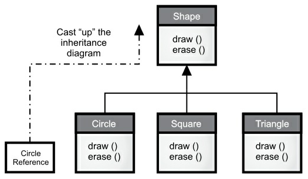
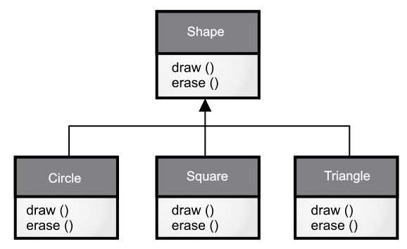
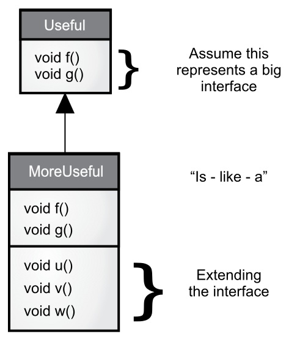

==**多态** 是面向对象编程语言中，继 **数据抽象（封装）**和 **继承** 之外的第三个重要特性。==

- 改善代码的组织

- 提高代码的可读性

- 创建有扩展性的程序

    > 无论在最初创建项目时还是在添加新特性时。


多态方法调用允许一种类型表现出与相似类型的区别，只要这些类型派生自一个基类。这种区别是当你通过基类调用时，由方法的不同行为表现出来的。


==**多态** 也称为 **动态绑定** 或 **后期绑定** 或 **运行时绑定**。==


# 向上转型回顾

**代码示例：**

创建一个枚举类：

```java
// polymorphism/music/Note.java
// Notes to play on musical instruments
package polymorphism.music;

public enum Note {
    MIDDLE_C, C_SHARP, B_FLAT; // Etc.
}
```

**Wind** 是一种 **Instrument**，因此，**Wind** 继承 **Instrument**：

```java
// polymorphism/music/Instrument.java
package polymorphism.music;

class Instrument {
    public void play(Note n) {
        System.out.println("Instrument.play()");
    }
}

// polymorphism/music/Wind.java
package polymorphism.music;
// Wind objects are instruments
// because they have the same interface:
public class Wind extends Instrument {
    // Redefine interface method:
    @Override
    public void play(Note n) {
        System.out.println("Wind.play() " + n);
    }
}
```

**Music** 的方法 `tune()` 接受一个 **Instrument** 引用，同时也接受任何派生自 **Instrument** 的类引用：

```java
// polymorphism/music/Music.java
// Inheritance & upcasting
// {java polymorphism.music.Music}
package polymorphism.music;

public class Music {
    public static void tune(Instrument i) {
        // ...
        i.play(Note.MIDDLE_C);
    }
    
    public static void main(String[] args) {
        Wind flute = new Wind();
        tune(flute); // Upcasting
    }
}
```

输出结果：

```
Wind.play() MIDDLE_C
```

在 `main()` 中 `tune()` 方法传入了一个 **Wind** 引用，而没有做类型转换（因为 **Instrument** 的接口一定存在于 **Wind** 中，因此 **Wind** 继承了 **Instrument**）。从 **Wind** 向上转型为 **Instrument** 可能 “缩小” 接口，但不会比 **Instrument** 的全部接口更少。


## 忘掉对象类型

如果 `tune()` 接受的参数是一个 **Wind** 引用，就要为系统内 **Instrument** 的每种类型都编写一个新的 `tune()` 方法。假设再增加 **Stringed** 和 **Brass** 这两种 **Instrument**：

```java
// polymorphism/music/Music2.java
// Overloading instead of upcasting
// {java polymorphism.music.Music2}
package polymorphism.music;

class Stringed extends Instrument {
    @Override
    public void play(Note n) {
        System.out.println("Stringed.play() " + n);
    }
}

class Brass extends Instrument {
    @Override
    public void play(Note n) {
        System.out.println("Brass.play() " + n);
    }
}

public class Music2 {
    public static void tune(Wind i) {
        i.play(Note.MIDDLE_C);
    }
    
    public static void tune(Stringed i) {
        i.play(Note.MIDDLE_C);
    }
    
    public static void tune(Brass i) {
        i.play(Note.MIDDLE_C);
    }
    
    public static void main(String[] args) {
        Wind flute = new Wind();
        Stringed violin = new Stringed();
        Brass frenchHorn = new Brass();
        tune(flute); // No upcasting
        tune(violin);
        tune(frenchHorn);
    }
}
```

输出结果：

```
Wind.play() MIDDLE_C
Stringed.play() MIDDLE_C
Brass.play() MIDDLE_C
```

这样可行，但有一个主要缺点：必须为添加的每个新 **Instrument** 类编写特定的方法。而且以后如果添加类似 `tune()` 的新方法或 **Instrument** 的新类型时，还有大量的工作要做。


# 转机

## 方法调用绑定

==将一个方法调用和一个方法主体关联起来称作 **绑定**。==

- 前期绑定：绑定发生在程序运行前。

    > 如果有的话，由编译器和链接器实现，面向过程语言的默认绑定方式，C 语言中只有前期绑定一种绑定方式。

- 后期绑定（动态绑定、运行时绑定）：在程序运行时根据对象的类型进行绑定。

    > 当一种语言实现了后期绑定，必须具有某种机制在运行时能判断对象的类型，从而调用恰当的方法，每种语言的后期绑定机制都不同。


==Java 中除了 **static** 和 **final**（**private** 方法也是隐式地 **final**）外，其他所有方法都是后期绑定。==

> 通常情况下，我们不需要判断后期绑定是否会发生——它自动发生。


## 产生正确的行为

==你向对象发送一条消息，让对象自己做正确的事。==


形状的例子中，有一个基类称为 **Shape** ，多个不同的派生类型分别是：**Circle**，**Square**，**Triangle** 等等。

继承图展示了它们之间的关系：



向上转型就像下面一样简单：

```java
Shape s = new Circle();
```

这会创建一个 **Circle** 对象，引用被赋值给 **Shape** 类型的变量 **s**。


假设你调用了一个基类方法（在各个派生类中都被重写）：

```java
s.draw()
```

==由于后期绑定（多态），被调用的是 **Circle** 的 `draw()` 方法。==


创建一个可复用的 **Shape** 类库，基类 **Shape** 为它的所有子类建立了公共接口：

```java
// polymorphism/shape/Shape.java
package polymorphism.shape;

public class Shape {
    public void draw() {}
    public void erase() {}
}
```

派生类通过重写这些方法为每个具体的形状提供独一无二的方法行为：

```java
// polymorphism/shape/Circle.java
package polymorphism.shape;

public class Circle extends Shape {
    @Override
    public void draw() {
        System.out.println("Circle.draw()");
    }
    @Override
    public void erase() {
        System.out.println("Circle.erase()");
    }
}

// polymorphism/shape/Square.java
package polymorphism.shape;

public class Square extends Shape {
    @Override
    public void draw() {
        System.out.println("Square.draw()");
    }
    @Override
    public void erase() {
        System.out.println("Square.erase()");
    }
 }

// polymorphism/shape/Triangle.java
package polymorphism.shape;

public class Triangle extends Shape {
    @Override
    public void draw() {
        System.out.println("Triangle.draw()");
    }
    @Override
    public void erase() {
        System.out.println("Triangle.erase()");
    }
}
```


**RandomShapes** 是一种工厂，每当我们调用 `get()` 方法时，就会产生一个指向随机创建的 **Shape** 对象的引用。注意，向上转型发生在 **return** 语句中，每条 **return** 语句取得一个指向某个 **Circle**，**Square** 或 **Triangle** 的引用， 并将其以 **Shape** 类型从 `get()` 方法发送出去。因此无论何时调用 `get()` 方法，你都无法知道具体的类型是什么，因为你总是得到一个简单的 **Shape** 引用：

```java
// polymorphism/shape/RandomShapes.java
// A "factory" that randomly creates shapes
package polymorphism.shape;
import java.util.*;

public class RandomShapes {
    private Random rand = new Random(47);
    
    public Shape get() {
        switch(rand.nextInt(3)) {
            default:
            case 0: return new Circle();
            case 1: return new Square();
            case 2: return new Triangle();
        }
    }
    
    public Shape[] array(int sz) {
        Shape[] shapes = new Shape[sz];
        // Fill up the array with shapes:
        for (int i = 0; i < shapes.length; i++) {
            shapes[i] = get();
        }
        return shapes;
    }
}
```

`array()` 方法分配并填充了 **Shape** 数组，这里使用了 for-in 表达式：

```java
// polymorphism/Shapes.java
// Polymorphism in Java
import polymorphism.shape.*;

public class Shapes {
    public static void main(String[] args) {
        RandomShapes gen = new RandomShapes();
        // Make polymorphic method calls:
        for (Shape shape: gen.array(9)) {
            shape.draw();
        }
    }
}
```

输出结果：

```
Triangle.draw()
Triangle.draw()
Square.draw()
Triangle.draw()
Square.draw()
Triangle.draw()
Square.draw()
Triangle.draw()
Circle.draw()
```

`main()` 方法中包含了一个 **Shape** 引用组成的数组，其中每个元素通过调用 **RandomShapes** 类的 `get()` 方法生成。


在编译时，编译器不需要知道任何具体信息以进行正确的调用。所有对方法 `draw()` 的调用都是通过动态绑定进行的。


## 可扩展性

由于多态机制，你可以向系统中添加任意多的新类型，而不需要修改 `tune()` 方法。在一个设计良好的面向对象程序中，许多方法将会遵循 `tune()` 的模型，只与基类接口通信。这样的程序是可扩展的，因为可以从通用的基类派生出新的数据类型，从而添加新的功能。那些操纵基类接口的方法不需要改动就可以应用于新类。


所有的新类都可以和原有类正常运行，不需要改动 `tune()` 方法。即使 `tune()` 方法单独存放在某个文件中，而且向 **Instrument** 接口中添加了新的方法，`tune()` 方法也无需再编译就能正确运行。下面是类图的实现：

```java
// polymorphism/music3/Music3.java
// An extensible program
// {java polymorphism.music3.Music3}
package polymorphism.music3;
import polymorphism.music.Note;

class Instrument {
    void play(Note n) {
        System.out.println("Instrument.play() " + n);
    }
    
    String what() {
        return "Instrument";
    }
    
    void adjust() {
        System.out.println("Adjusting Instrument");
    }
}

class Wind extends Instrument {
    @Override
    void play(Note n) {
        System.out.println("Wind.play() " + n);
    }
    @Override
    String what() {
        return "Wind";
    }
    @Override
    void adjust() {
        System.out.println("Adjusting Wind");
    }
}

class Percussion extends Instrument {
    @Override
    void play(Note n) {
        System.out.println("Percussion.play() " + n);
    }
    @Override
    String what() {
        return "Percussion";
    }
    @Override
    void adjust() {
        System.out.println("Adjusting Percussion");
    }
}

class Stringed extends Instrument {
    @Override
    void play(Note n) {
        System.out.println("Stringed.play() " + n);
    } 
    @Override
    String what() {
        return "Stringed";
    }
    @Override
    void adjust() {
        System.out.println("Adjusting Stringed");
    }
}

class Brass extends Wind {
    @Override
    void play(Note n) {
        System.out.println("Brass.play() " + n);
    }
    @Override
    void adjust() {
        System.out.println("Adjusting Brass");
    }
}

class Woodwind extends Wind {
    @Override
    void play(Note n) {
        System.out.println("Woodwind.play() " + n);
    }
    @Override
    String what() {
        return "Woodwind";
    }
}

public class Music3 {
    // Doesn't care about type, so new types
    // added to the system still work right:
    public static void tune(Instrument i) {
        // ...
        i.play(Note.MIDDLE_C);
    }
    
    public static void tuneAll(Instrument[] e) {
        for (Instrument i: e) {
            tune(i);
        }
    }
    
    public static void main(String[] args) {
        // Upcasting during addition to the array:
        Instrument[] orchestra = {
            new Wind(),
            new Percussion(),
            new Stringed(),
            new Brass(),
            new Woodwind()
        };
        tuneAll(orchestra);
    }
}
```

输出结果：

```
Wind.play() MIDDLE_C
Percussion.play() MIDDLE_C
Stringed.play() MIDDLE_C
Brass.play() MIDDLE_C
Woodwind.play() MIDDLE_C
```

新方法 `what()` 返回一个带有类描述的 **String** 引用，`adjust()` 提供一些乐器调音的方法。

在 `main()` 方法中，当向 **orchestra** 数组添加元素时，元素会自动向上转型为 **Instrument**。

`tune()` 方法可以忽略周围所有代码发生的变化，仍然可以正常运行。这正是我们期待多态能提供的特性。代码中的修改不会破坏程序中其他不应受到影响的部分。


==多态是一项 **将改变的事物与不变的事物分离** 的重要技术。==


## 陷阱：”重写“ 私有方法

**代码示例：**

```java
// polymorphism/PrivateOverride.java
// Trying to override a private method
// {java polymorphism.PrivateOverride}
package polymorphism;

public class PrivateOverride {
    private void f() {
        System.out.println("private f()");
    }
    
    public static void main(String[] args) {
        PrivateOverride po = new Derived();
        po.f();
    }
}

class Derived extends PrivateOverride {
    public void f() {
        System.out.println("public f()");
    }
}
```

输出结果：

```
private f()
```

你可能期望输出是 **public f()** ，然而 **private** 方法可以当作是 **final** 的，对于派生类来说是隐蔽的。因此，这里 **Derived** 的 `f()`是一个全新的方法；因为基类版本的 `f()` 屏蔽了 **Derived** ，因此它都不算是重写方法。


==只有非 **private** 方法才能被重写，派生类中的方法名采用与基类中 **private** 方法名不同的命名。==


如果使用 `@Override` 注解，就能检测问题：

```java
// polymorphism/PrivateOverride2.java
// Detecting a mistaken override using @Override
// {WillNotCompile}
package polymorphism;

public class PrivateOverride2 {
    private void f() {
        System.out.println("private f()");
    }
    
    public static void main(String[] args) {
        PrivateOverride2 po = new Derived2();
        po.f();
    }
}

class Derived2 extends PrivateOverride2 {
    @Override
    public void f() {
        System.out.println("public f()");
    }
}
```

编译器报错信息：

```
error: method does not override or
implement a method from a supertype
```


## 陷阱：属性与静态方法

==只有普通的方法调用可以是多态的。==


如果直接访问一个属性，该访问会在编译时解析：

```java
// polymorphism/FieldAccess.java
// Direct field access is determined at compile time
class Super {
    public int field = 0;
    
    public int getField() {
        return field;
    }
}

class Sub extends Super {
    public int field = 1;
    
    @Override
    public int getField() {
        return field;
    }
    
    public int getSuperField() {
        return super.field;
    }
}

public class FieldAccess {
    public static void main(String[] args) {
        Super sup = new Sub(); // Upcast
        System.out.println("sup.field = " + sup.field + 
                          ", sup.getField() = " + sup.getField());
        Sub sub = new Sub();
        System.out.println("sub.field = " + sub.field + 
                          ", sub.getField() = " + sub.getField()
                          + ", sub.getSuperField() = " + sub.getSuperField())
    }
}
```

输出结果：

```
sup.field = 0, sup.getField() = 1
sub.field = 1, sub.getField() = 1, sub.getSuperField() = 0
```

当 **Sub** 对象向上转型为 **Super** 引用时，任何属性访问都被编译器解析，因此不是多态的。在这个例子中，**Super.field** 和 **Sub.field** 被分配了不同的存储空间，因此，**Sub** 实际上包含了两个称为 **field** 的属性：它自己的和来自 **Super** 的。然而，在引用 **Sub** 的 **field** 时，默认的 **field** 属性并不是 **Super** 版本的 **field** 属性。为了获取 **Super** 的 **field** 属性，需要显式地指明 **super.field**。

> 实际上基本不会发生。首先，通常会将所有的属性都指明为 **private**，因此不能直接访问它们，只能通过方法来访问。此外，你可能也不会给基类属性和派生类属性起相同的名字，这样做会令人困惑。


==如果一个方法是 **静态（static）**的，它的行为就不具有多态性：==

```java
// polymorphism/StaticPolymorphism.java
// static methods are not polymorphic
class StaticSuper {
    public static String staticGet() {
        return "Base staticGet()";
    }
    
    public String dynamicGet() {
        return "Base dynamicGet()";
    }
}

class StaticSub extends StaticSuper {
    public static String staticGet() {
        return "Derived staticGet()";
    }
    @Override
    public String dynamicGet() {
        return "Derived dynamicGet()";
    }
}

public class StaticPolymorphism {
    public static void main(String[] args) {
        StaticSuper sup = new StaticSub(); // Upcast
        System.out.println(StaticSuper.staticGet());
        System.out.println(sup.dynamicGet());
    }
}
```

输出结果：

```
Base staticGet()
Derived dynamicGet()
```

==静态的方法只与类关联，与单个的对象无关。==


# 构造器和多态

==构造器不具有多态性。==

> 事实上人们会把它看做是隐式声明的静态方法。


## 构造器调用顺序

==在派生类的构造过程中总会调用基类的构造器，初始化会自动按继承层次上移，因此每个基类的构造器都会被调用到。==

> **意义：**
>
> 构造器可以检查对象是否被正确地构造。


组合、继承和多态在构建顺序上的作用：

```java
// polymorphism/Sandwich.java
// Order of constructor calls
// {java polymorphism.Sandwich}
package polymorphism;

class Meal {
    Meal() {
        System.out.println("Meal()");
    }
}

class Bread {
    Bread() {
        System.out.println("Bread()");
    }
}

class Cheese {
    Cheese() {
        System.out.println("Cheese()");
    }
}

class Lettuce {
    Lettuce() {
        System.out.println("Lettuce()");
    }
}

class Lunch extends Meal {
    Lunch() {
        System.out.println("Lunch()");
    }
}

class PortableLunch extends Lunch {
    PortableLunch() {
        System.out.println("PortableLunch()");
    }
}

public class Sandwich extends PortableLunch {
    private Bread b = new Bread();
    private Cheese c = new Cheese();
    private Lettuce l = new Lettuce();
    
    public Sandwich() {
        System.out.println("Sandwich()");
    }
    
    public static void main(String[] args) {
        new Sandwich();
    }
}
```

输出结果：

```
Meal()
Lunch()
PortableLunch()
Bread()
Cheese()
Lettuce()
Sandwich()
```

==从创建 **Sandwich** 对象的输出中可以看出对象的构造器调用顺序如下：==

1. 基类构造器被调用。这个步骤被递归地重复，这样一来类层次的顶级父类会被最先构造，然后是它的派生类，以此类推，直到最底层的派生类。
2. 按声明顺序初始化成员。
3. 调用派生类构造器的方法体。


> **注意：**
>
> - 构造器的调用顺序很重要。当使用继承时，就已经知道了基类的一切，并可以访问基类中任意 **public** 和 **protected** 的成员。这意味着在派生类中可以假定所有的基类成员都是有效的。在一个标准方法中，构造动作已经发生过，对象其他部分的所有成员都已经创建好。
> - 在构造器中必须确保所有的成员都已经构建完。唯一能保证这点的方法就是首先调用基类的构造器。接着，在派生类的构造器中，所有你可以访问的基类成员都已经初始化。
> - 有可能的话，你应该在所有成员对象（通过组合将对象置于类中）定义处初始化它们（例如，例子中的 **b**、**c** 和 **l**）。如果遵循这条实践，就可以帮助确保所有的基类成员和当前对象的成员对象都已经初始化。


## 继承和清理

在使用组合和继承创建新类时，大部分时候你无需关心清理。子对象通常会留给垃圾收集器处理。如果你存在清理问题，那么必须为新类创建一个 `dispose()` 方法（示例名称）。由于继承，如果有其他特殊的清理工作的话，就必须在派生类中重写 `dispose()` 方法。当重写 `dispose()` 方法时，记得调用基类的 `dispose()` 方法，否则基类的清理工作不会发生：

```java
// polymorphism/Frog.java
// Cleanup and inheritance
// {java polymorphism.Frog}
package polymorphism;

class Characteristic {
    private String s;
    
    Characteristic(String s) {
        this.s = s;
        System.out.println("Creating Characteristic " + s);
    }
    
    protected void dispose() {
        System.out.println("disposing Characteristic " + s);
    }
}

class Description {
    private String s;
    
    Description(String s) {
        this.s = s;
        System.out.println("Creating Description " + s);
    }
    
    protected void dispose() {
        System.out.println("disposing Description " + s);
    }
}

class LivingCreature {
    private Characteristic p = new Characteristic("is alive");
    private Description t = new Description("Basic Living Creature");
    
    LivingCreature() {
        System.out.println("LivingCreature()");
    }
    
    protected void dispose() {
        System.out.println("LivingCreature dispose");
        t.dispose();
        p.dispose();
    }
}

class Animal extends LivingCreature {
    private Characteristic p = new Characteristic("has heart");
    private Description t = new Description("Animal not Vegetable");
    
    Animal() {
        System.out.println("Animal()");
    }
    
    @Override
    protected void dispose() {
        System.out.println("Animal dispose");
        t.dispose();
        p.dispose();
        super.dispose();
    }
}

class Amphibian extends Animal {
    private Characteristic p = new Characteristic("can live in water");
    private Description t = new Description("Both water and land");
    
    Amphibian() {
        System.out.println("Amphibian()");
    }
    
    @Override
    protected void dispose() {
        System.out.println("Amphibian dispose");
        t.dispose();
        p.dispose();
        super.dispose();
    }
}

public class Frog extends Amphibian {
    private Characteristic p = new Characteristic("Croaks");
    private Description t = new Description("Eats Bugs");
    
    public Frog() {
        System.out.println("Frog()");
    }
    
    @Override
    protected void dispose() {
        System.out.println("Frog dispose");
        t.dispose();
        p.dispose();
        super.dispose();
    }
    
    public static void main(String[] args) {
        Frog frog = new Frog();
        System.out.println("Bye!");
        frog.dispose();
    }
}
```

输出结果：

```
Creating Characteristic is alive
Creating Description Basic Living Creature
LivingCreature()
Creating Characteristiv has heart
Creating Description Animal not Vegetable
Animal()
Creating Characteristic can live in water
Creating Description Both water and land
Amphibian()
Creating Characteristic Croaks
Creating Description Eats Bugs
Frog()
Bye!
Frog dispose
disposing Description Eats Bugs
disposing Characteristic Croaks
Amphibian dispose
disposing Description Both wanter and land
disposing Characteristic can live in water
Animal dispose
disposing Description Animal not Vegetable
disposing Characteristic has heart
LivingCreature dispose
disposing Description Basic Living Creature
disposing Characteristic is alive
```

- ==销毁的顺序应该与初始化的顺序相反，以防一个对象依赖另一个对象。==

- 对于属性来说，就意味着与声明的顺序相反（因为属性是按照声明顺序初始化的）。对于基类（遵循 C++ 析构函数的形式），首先进行派生类的清理工作，然后才是基类的清理。这是因为派生类的清理可能调用基类的一些方法，所以基类组件这时得存活，不能过早地被销毁。


一旦某个成员对象被其它一个或多个对象共享时，问题就变得复杂了，不能只是简单地调用 `dispose()`。这里，也许就必须使用 **引用计数** 来跟踪仍然访问着共享对象的对象数量，如下：

```java
// polymorphism/ReferenceCounting.java
// Cleaning up shared member objects
class Shared {
    private int refcount = 0;
    private static long counter = 0;
    private final long id = counter++;
    
    Shared() {
        System.out.println("Creating " + this);
    }
    
    public void addRef() {
        refcount++;
    }
    
    protected void dispose() {
        if (--refcount == 0) {
            System.out.println("Disposing " + this);
        }
    }
    
    @Override
    public String toString() {
        return "Shared " + id;
    }
}

class Composing {
    private Shared shared;
    private static long counter = 0;
    private final long id = counter++;
    
    Composing(Shared shared) {
        System.out.println("Creating " + this);
        this.shared = shared;
        this.shared.addRef();
    }
    
    protected void dispose() {
        System.out.println("disposing " + this);
        shared.dispose();
    }
    
    @Override
    public String toString() {
        return "Composing " + id;
    }
}

public class ReferenceCounting {
    public static void main(String[] args) {
        Shared shared = new Shared();
        Composing[] composing = {
            new Composing(shared),
            new Composing(shared),
            new Composing(shared),
            new Composing(shared),
            new Composing(shared),
        };
        for (Composing c: composing) {
            c.dispose();
        }
    }
}
```

输出结果：

```
Creating Shared 0
Creating Composing 0
Creating Composing 1
Creating Composing 2
Creating Composing 3
Creating Composing 4
disposing Composing 0
disposing Composing 1
disposing Composing 2
disposing Composing 3
disposing Composing 4
Disposing Shared 0
```

- **static long counter** 跟踪所创建的 **Shared** 实例数量，还提供了 **id** 的值。**counter** 的类型是 **long** 而不是 **int**，以防溢出。**id** 是 **final** 的，因为它的值在初始化时确定后不应该变化。

- 在将一个 **shared** 对象附着在类上时，必须记住调用 `addRef()`，而 `dispose()` 方法会跟踪引用数，以确定在何时真正地执行清理工作。


## 构造器内部多态方法的行为

==在普通的方法中，动态绑定的调用是在运行时解析的，因为对象不知道它属于方法所在的类还是类的派生类。==

> 如果在构造器中调用了动态绑定方法，就会用到那个方法的重写定义。然而，调用的结果难以预料因为被重写的方法在对象被完全构造出来之前已经被调用，这使得一些 bug 很隐蔽，难以发现。


从概念上讲，构造器的工作就是创建对象。在构造器内部，整个对象可能只是部分形成——只知道基类对象已经初始化。如果构造器只是构造对象过程中的一个步骤，且构造的对象所属的类是从构造器所属的类派生出的，那么派生部分在当前构造器被调用时还没有初始化。然而，一个动态绑定的方法调用向外深入到继承层次结构中，它可以调用派生类的方法。如果你在构造器中这么做，就可能调用一个方法，该方法操纵的成员可能还没有初始化。

**代码示例：**

```java
// polymorphism/PolyConstructors.java
// Constructors and polymorphism
// don't produce what you might expect
class Glyph {
    void draw() {
        System.out.println("Glyph.draw()");
    }

    Glyph() {
        System.out.println("Glyph() before draw()");
        draw();
        System.out.println("Glyph() after draw()");
    }
}

class RoundGlyph extends Glyph {
    private int radius = 1;

    RoundGlyph(int r) {
        radius = r;
        System.out.println("RoundGlyph.RoundGlyph(), radius = " + radius);
    }

    @Override
    void draw() {
        System.out.println("RoundGlyph.draw(), radius = " + radius);
    }
}

public class PolyConstructors {
    public static void main(String[] args) {
        new RoundGlyph(5);
    }
}
```

输出结果：

```
Glyph() before draw()
RoundGlyph.draw(), radius = 0
Glyph() after draw()
RoundGlyph.RoundGlyph(), radius = 5
```

**Glyph** 的 `draw()` 被设计为可重写，在 **RoundGlyph** 这个方法被重写。但是 **Glyph** 的构造器里调用了这个方法，结果调用了 **RoundGlyph** 的 `draw()` 方法，这看起来正是我们的目的。输出结果表明，当 **Glyph** 构造器调用了 `draw()` 时，**radius** 的值不是默认初始值 1 而是 0。


==**初始化的实际过程：**==

1. 在所有事发生之前，分配给对象的存储空间会被初始化为二进制 0。
2. 调用基类的构造器。此时调用重写后的 `draw()` 方法（上述示例，在调用 **RoundGlyph** 构造器之前调用），由步骤 1 可知，**radius** 的值为 0。
3. 按声明顺序初始化成员。
4. 最终调用派生类的构造器。

> 优点：
>
> 所有事物至少初始化为 **0**（或某些特殊数据类型与 0 等价的值），通过组合嵌入类中的对象引用被赋予 **null**。


==编写构造器的规范：==

1. 做尽量少的事让对象进入良好状态。
2. 尽量不要调用类中的任何方法。
3. 在基类的构造器中能安全调用的只有基类的 **final** 方法（这也适用于可被看做是 **final** 的 **private** 方法），这些方法不能被重写。


# 协变返回类型

Java 5 中引入了协变返回类型，这表示派生类的被重写方法可以返回基类方法返回类型的派生类型：

```java
// polymorphism/CovariantReturn.java
class Grain {
    @Override
    public String toString() {
        return "Grain";
    }
}

class Wheat extends Grain {
    @Override
    public String toString() {
        return "Wheat";
    }
}

class Mill {
    Grain process() {
        return new Grain();
    }
}

class WheatMill extends Mill {
    @Override
    Wheat process() {
        return new Wheat();
    }
}

public class CovariantReturn {
    public static void main(String[] args) {
        Mill m = new Mill();
        Grain g = m.process();
        System.out.println(g);
        m = new WheatMill();
        g = m.process();
        System.out.println(g);
    }
}
```

输出结果：

```
Grain
Wheat
```

关键区别在于 Java 5 之前的版本强制要求被重写的 `process()` 方法必须返回 **Grain** 而不是 **Wheat**，即使 **Wheat** 派生自 **Grain**，因而也应该是一种合法的返回类型。协变返回类型允许返回更具体的 **Wheat** 类型。


# 使用继承设计

==组合不会强制设计是继承层次结构，而且组合更加灵活，因为可以动态地选择类型（因而选择相应的行为），而继承要求必须在编译时知道确切类型。==

**代码示例：**

```java
// polymorphism/Transmogrify.java
// Dynamically changing the behavior of an object
// via composition (the "State" design pattern)
class Actor {
    public void act() {}
}

class HappyActor extends Actor {
    @Override
    public void act() {
        System.out.println("HappyActor");
    }
}

class SadActor extends Actor {
    @Override
    public void act() {
        System.out.println("SadActor");
    }
}

class Stage {
    private Actor actor = new HappyActor();
    
    public void change() {
        actor = new SadActor();
    }
    
    public void performPlay() {
        actor.act();
    }
}

public class Transmogrify {
    public static void main(String[] args) {
        Stage stage = new Stage();
        stage.performPlay();
        stage.change();
        stage.performPlay();
    }
}
```

输出结果：

```
HappyActor
SadActor
```

引用可以在运行时与其他不同的对象绑定，那么它就可以被替换成对 **SadActor** 的引用，`performPlay()` 的行为随之改变。这样你就获得了运行时的动态灵活性（这被称为 **状态模式**）。与之相反，我们无法在运行时才决定继承不同的对象；那在编译时就完全决定好了。


==**通用准则：**使用继承表达行为的差异，使用属性表达状态的变化。==


## 替代 vs 扩展

只有基类的方法才能在派生类中被重写，就像下图这样：



==这被称作纯粹的 “is - a” 关系==，因为类的接口已经确定了它是什么。**继承可以确保任何派生类都拥有基类的接口，绝对不会少。**如果按图上这么做，派生类将只拥有基类的接口。


纯粹的替代意味着派生类可以完美地替代基类，当使用它们时，完全不需要知道这些子类的信息。也就是说，基类可以接收任意发送给派生类的消息，因为它们具有完全相同的接口。只需将派生类向上转型，不要关注对象的具体类型。所有一切都可以通过多态处理。


==继承扩展接口，可以称为 ”is - like -a“ 关系==，因为派生类就像是基类——它有着相同的基本接口，但还具有需要额外方法实现的其他特性：



虽然这是一种有用且明智的方法（依赖具体情况），但是也存在缺点。派生类中接口的扩展部分在基类中不存在（不能通过基类访问到这些扩展接口），因此一旦向上转型，就不能通过基类调用这些新方法：


如果不向上转型，就不会遇到这个问题。但是通常情况下，我们需要重新查明对象的确切类型，从而能够访问该类型中的扩展方法。


## 向下转型与运行时类型信息

==由于向上转型（在继承层次中向上移动）会丢失具体的类型信息，那么为了重新获取类型信息，就需要在继承层次中向下移动，使用 **向下转型**。==


==在 Java 中，每次转型都会被检查，以确保它的确是希望的那种类型。如果不是，就会得到 ClassCastException （类转型异常）。这种在运行时检查类型的行为称作 **运行时类型信息（RTTI）**。==

**下面例子展示了 RTTI 的行为：**

```java
// polymorphism/RTTI.java
// Downcasting & Runtime type information (RTTI)
// {ThrowsException}
class Useful {
    public void f() {}
    public void g() {}
}

class MoreUseful extends Useful {
    @Override
    public void f() {}
    @Override
    public void g() {}
    public void u() {}
    public void v() {}
    public void w() {}
}

public class RTTI {
    public static void main(String[] args) {
        Useful[] x = {
            new Useful(),
            new MoreUseful()
        };
        x[0].f();
        x[1].g();
        // Compile time: method not found in Useful:
        //- x[1].u();
        ((MoreUseful) x[1]).u(); // Downcast/RTTI
        ((MoreUseful) x[0]).u(); // Exception thrown
    }
}
```

输出结果：

```
Exception in thread "main"
java.lang.ClassCastException: Useful cannot be cast to
MoreUseful
at RTTI.main
```

为了访问 **MoreUseful** 对象的扩展接口，就得尝试向下转型。如果转型为正确的类型，就转型成功。否则，就会得到 ClassCastException 异常。

