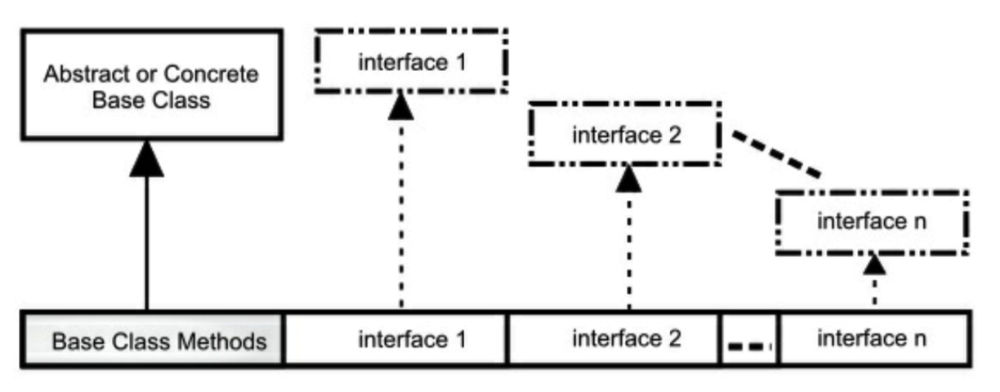

==接口和抽象类提供了一种将接口与实现分离的更加结构化的方法。==

> Java 为它们提供了直接支持。


# 抽象类和方法

==**抽象方法：**只有声明没有方法体。==

**语法：**

```java
abstract void f();
```

==包含抽象方法的叫做 **抽象类**。==

> 如果一个类包含一个或多个抽象方法，那么类本身也必须是抽象的，否则编译器会报错。

```java
// interface/Basic.java
abstract class Basic {
    abstract void unimplemented();
}
```

如果一个抽象类是不完整的，当试图创建这个类的对象时，编译器会报错：

```java
// interfaces/AttemptToUseBasic.java
// {WillNotCompile}
public class AttemptToUseBasic {
    Basic b = new Basic();
    // error: Basic is abstract; cannot be instantiated
}
```

如果创建一个继承抽象类的新类并为之创建对象，那么就必须为基类的所有抽象方法提供方法定义。

> 如果不这么做（可以选择不做），新类仍然是一个抽象类，编译器会强制为新类加上 **abstract** 关键字。

```java
// interfaces/Basic2.java
abstract class Basic2 extends Basic {
    int f() {
        return 111;
    }
    
    abstract void g() {
        // unimplemented() still not implemented
    }
}
```

可以将一个不包含任何抽象方法的类指明为 **abstract**，在类中的抽象方法没意义但想阻止创建类的对象时有用。

```java
// interfaces/AbstractWithoutAbstracts.java
abstract class Basic3 {
    int f() {
        return 111;
    }
    
    // No abstract methods
}

public class AbstractWithoutAbstracts {
    // Basic3 b3 = new Basic3();
    // error: Basic3 is abstract; cannot be instantiated
}
```

**为了创建可初始化的类，就要继承抽象类，并提供所有抽象方法的定义：**

```java
// interfaces/Instantiable.java
abstract class Uninstantiable {
    abstract void f();
    abstract int g();
}

public class Instantiable extends Uninstantiable {
    @Override
    void f() {
        System.out.println("f()");
    }
    
    @Override
    int g() {
        return 22;
    }
    
    public static void main(String[] args) {
        Uninstantiable ui = new Instantiable();
    }
}
```

**如果没有 `@Override`，你没有定义相同的方法名或签名，抽象机制会认为你没有实现抽象方法从而产生编译时错误。**


==接口只允许 **public** 方法，如果不加访问修饰符的话，接口的方法不是 **friendly（包访问权限）** 而是 **public**。==


抽象类允许每件事：

```java
// interfaces/AbstractAccess.java
abstract class AbstractAccess {
    private void m1() {}
    
    // private abstract void m1a(); // illegal
    
    protected void m2() {}
    
    protected abstract void m2a();
    
    void m3() {}
    
    abstract void m3a();
    
    public void m4() {}
    
    public abstract void m4a();
}
```

- 将一个类指明为 **abstract** 并不强制类中的所有方法必须都是抽象方法。
- **private abstract** 被禁止了是有意义的，因为你不可能在抽象类的任何子类中合法地定义它。


==抽象类和抽象方法使得类的抽象性很明确。==


# 接口创建

==使用 **interface** 关键字创建接口。==


==Java 8 允许接口包含默认方法和静态方法。==

> 接口的概念依然是 **介于类型之上、实现之下**。


**接口与抽象类使用方式：**

- 接口的典型使用是代表一个类的类型或一个形容词，如 **Runnable** 或 **Serializable**。
- 抽象类通常是类层次结构的一部分或一件事物的类型，如 **String** 或 **ActionHero**。


==接口同样可以包含属性，这些属性被隐式指明为 **static** 和 **final**。==


==使用 **implements** 关键字使一个类遵循某个特定接口（或一组接口）。==

> 它表示接口只是外形，现在要说明它是如何工作的。

**代码示例：**

```java
// interfaces/ImplementingAnInterface.java
interface Concept { // Package access
    void idea1();
    void idea2();
}

class Implementation implements Concept {
    @Override
    public void idea1() {
        System.out.println("idea1");
    }
    
    @Override
    public void idea2() {
        System.out.println("idea2");
    }
}
```

==接口中的方法默认是 **public**，实现接口时，来自接口中的方法必须被定义为 **public**。==


## 默认方法

==Java 8 中，任何实现接口却没有定义方法的时候可以使用 **default** 创建的方法体。==

**代码示例：**

```java
// interfaces/AnInterface.java
interface AnInterface {
    void firstMethod();
    void secondMethod();
}
```

实现接口：

```java
// interfaces/AnImplementation.java
public class AnImplementation implements AnInterface {
    public void firstMethod() {
        System.out.println("firstMethod");
    }
    
    public void secondMethod() {
        System.out.println("secondMethod");
    }
    
    public static void main(String[] args) {
        AnInterface i = new AnImplementation();
        i.firstMethod();
        i.secondMethod();
    }
}
```

输出结果：

```
firstMethod
secondMethod
```

使用 **default** 为`newMethod()` 方法提供默认实现，否则编译器会报错：

```java
// interfaces/InterfaceWithDefault.java
interface InterfaceWithDefault {
    void firstMethod();
    void secondMethod();
    
    default void newMethod() {
        System.out.println("newMethod");
    }
}
```

关键字 **default** 允许在接口中提供方法实现（Java 8 之前被禁止）

```java
// interfaces/Implementation2.java
public class Implementation2 implements InterfaceWithDefault {
    @Override
    public void firstMethod() {
        System.out.println("firstMethod");
    }
    
    @Override
    public void secondMethod() {
        System.out.println("secondMethod")
    }
    
    public static void main(String[] args) {
        InterfaceWithDefault i = new Implementation2();
        i.firstMethod();
        i.secondMethod();
        i.newMethod();
    }
}
```

输出结果：

```
firstMethod
secondMethod
newMethod
```


==默认方法允许在不破坏已使用接口的代码的情况下，在接口中增加新的方法。默认方法也被称为 **守卫方法** 或 **虚拟扩展方法**。==


## 多继承

==多继承意味着一个类可能从多个父类型中继承特征和特性。==


**Java 通过默认方法具有了某种多继承的特性。**

> - 结合带有默认方法的接口意味着结合了多个基类中的行为。
> - 因为接口中仍然不允许存在属性（只有静态属性，不适用），所以属性仍然只会来自单个基类或抽象类，**不会存在状态的多继承**。

**代码示例：**

```java
// interfaces/MultipleInheritance.java
import java.util.*;

interface One {
    default void first() {
        System.out.println("first");
    }
}

interface Two {
    default void second() {
        System.out.println("second");
    }
}

interface Three {
    default void third() {
        System.out.println("third");
    }
}

class MI implements One, Two, Three {}

public class MultipleInheritance {
    public static void main(String[] args) {
        MI mi = new MI();
        mi.first();
        mi.second();
        mi.third();
    }
}
```

输出结果：

```
first
second
third
```


**结合多个源的实现：**

> 需要基类方法中的方法名和参数列表不同，否则编译器会报错。

```java
// interface/MICollision.java
import java.util.*;

interface Bob1 {
    default void bob() {
        System.out.println("Bob1::bob");
    }
}

interface Bob2 {
    default void bob() {
        System.out.println("Bob2::bob");
    }
}

// class Bob implements Bob1, Bob2 {}
/* Produces:
error: class Bob inherits unrelated defaults
for bob() from types Bob1 and Bob2
class Bob implements Bob1, Bob2 {}
^
1 error
*/

interface Sam1 {
    default void sam() {
        System.out.println("Sam1::sam");
    }
}

interface Sam2 {
    default void sam(int i) {
        System.out.println(i * 2);
    }
}

// This works because the argument lists are distinct:
class Sam implements Sam1, Sam2 {}

interface Max1 {
    default void max() {
        System.out.println("Max1::max");
    }
}

interface Max2 {
    default int max() {
        return 47;
    }
}

// class Max implements Max1, Max2 {}
/* Produces:
error: types Max2 and Max1 are imcompatible;
both define max(), but with unrelated return types
class Max implements Max1, Max2 {}
^
1 error
*/
```

- **Sam** 类中的两个 `sam()` 方法有相同的方法名但是签名不同（方法签名包括方法名和参数类型），编译器用它来区分方法。

- **Max** 类中由于返回类型不是方法签名的一部分，因此不能用来区分方法。

所以需要覆写冲突的方法：

```java
// interfaces/Jim.java
import java.util.*;

interface Jim1 {
    default void jim() {
        System.out.println("Jim1::jim");
    }
}

interface Jim2 {
    default void jim() {
        System.out.println("Jim2::jim");
    }
}

public class Jim implements Jim1, Jim2 {
    @Override
    public void jim() {
        Jim2.super.jim();
    }
    
    public static void main(String[] args) {
        new Jim().jim();
    }
}
```

输出结果：

```
Jim2::jim
```


## 接口中的静态方法

==Java 8 允许在接口中添加静态方法。==


这么做能恰当地把工具功能置于接口中，从而操作接口，或者成为通用的工具：

```java
// onjava/Operations.java
package onjava;
import java.util.*;

public interface Operations {
    void execute();
    
    static void runOps(Operations... ops) {
        for (Operations op: ops) {
            op.execute();
        }
    }
    
    static void show(String msg) {
        System.out.println(msg);
    }
}
```

这是 **模板方法** 设计模式的一个版本，`runOps()` 是一个模板方法。`runOps()` 使用可变参数列表，因而我们可以传入任意多的 **Operation** 参数并按顺序运行它们：

```java
// interface/Machine.java
import java.util.*;
import onjava.Operations;

class Bing implements Operations {
    @Override
    public void execute() {
        Operations.show("Bing");
    }
}

class Crack implements Operations {
    @Override
    public void execute() {
        Operations.show("Crack");
    }
}

class Twist implements Operations {
    @Override
    public void execute() {
        Operations.show("Twist");
    }
}

public class Machine {
    public static void main(String[] args) {
        Operations.runOps(
            new Bing(), new Crack(), new Twist());
    }
}
```

输出结果：

```
Bing
Crack
Twist
```


## Instrucment 作为接口

乐器例子使用接口：


类 **Woodwind** 和 **Brass** 说明一旦实现了某个接口，那么其实现就变成一个普通类，可以按常规方式扩展它。


接口的工作方式使得我们不需要显式声明其中的方法为 **public**，它们自动就是 **public** 的。`play()` 和 `adjust()` 使用 **default** 关键字定义实现。


# 抽象类和接口

|         特性         |                             接口                             |                  抽象类                  |
| :------------------: | :----------------------------------------------------------: | :--------------------------------------: |
|         组合         |                     新类可以组合多个接口                     |            只能继承单一抽象类            |
|         状态         |         不能包含属性（除了静态属性，不支持对象状态）         | 可以包含属性，非抽象方法可以引用这些属性 |
| 默认方法 和 抽象方法 | 不需要在子类中实现默认方法。默认方法可以引用其他接口的方法。 |         必须在子类中实现抽象方法         |
|        构造器        |                          没有构造器                          |               可以有构造器               |
|        可见性        |                       隐式 **public**                        |   可以是 **protected** 或 **friendly**   |


# 完全解耦

==接口可以编写复用性更好的代码。==


**Processor** 的各个子类修改 String 对象（返回类型可能是协变类型而非参数类型）：

```java
// interfaces/Applicator.java
import java.util.*;

class Processor {
    public String name() {
        return getClass().getSimpleName();
    }
    
    public Object process(Object input) {
        return input;
    }
}

class Upcase extends Processor {
    // 返回协变类型
    @Override 
    public String process(Object input) {
        return ((String) input).toUpperCase();
    }
}

class Downcase extends Processor {
    @Override
    public String process(Object input) {
        return ((String) input).toLowerCase();
    }
}

class Splitter extends Processor {
    @Override
    public String process(Object input) {
        // split() divides a String into pieces:
        return Arrays.toString(((String) input).split(" "));
    }
}

public class Applicator {
    public static void apply(Processor p, Object s) {
        System.out.println("Using Processor " + p.name());
        System.out.println(p.process(s));
    }
    
    public static void main(String[] args) {
        String s = "We are such stuff as dreams are made on";
        apply(new Upcase(), s);
        apply(new Downcase(), s);
        apply(new Splitter(), s);
    }
}
```

输出结果：

```
Using Processor Upcase
WE ARE SUCH STUFF AS DREAMS ARE MADE ON
Using Processor Downcase
we are such stuff as dreams are made on
Using Processor Splitter
[We, are, such, stuff, as, dreams, are, made, on]
```

**Applicator** 的 `apply()` 方法可以接受任何类型的 **Processor**，并将其应用到一个 **Object** 对象上输出结果。


==创建一个能根据传入的参数类型从而具备不同行为的方法称为 **策略设计模式**。==

> - 方法包含算法中不变的部分，策略包含变化的部分。
> - 策略就是传入的对象，它包含要执行的代码。


在这里，**Processor** 对象是策略，`main()` 方法展示了三种不同的应用于 **String s** 上的策略。


改变 **Processor** 为接口：

```java
// interfaces/interfaceprocessor/Processor.java
package interfaces.interfaceprocessor;

public interface Processor {
    default String name() {
        return getClass().getSimpleName();
    }
    
    Object process(Object input);
}

// interfaces/interfaceprocessor/Applicator.java
package interfaces.interfaceprocessor;

public class Applicator {
    public static void apply(Processor p, Object s) {
        System.out.println("Using Processor " + p.name());
        System.out.println(p.process(s));
    }
}
```

**复用代码的第一种方式：**

```java
// interfaces/interfaceprocessor/StringProcessor.java
// {java interfaces.interfaceprocessor.StringProcessor}
package interfaces.interfaceprocessor;
import java.util.*;

interface StringProcessor extends Processor {
    @Override
    String process(Object input); // [1]
    String S = "If she weighs the same as a duck, she's made of wood"; // [2]
    
    static void main(String[] args) { // [3]
        Applicator.apply(new Upcase(), S);
        Applicator.apply(new Downcase(), S);
        Applicator.apply(new Splitter(), S);
    }
}

class Upcase implements StringProcessor {
    // 返回协变类型
    @Override
    public String process(Object input) {
        return ((String) input).toUpperCase();
    }
}

class Downcase implements StringProcessor {
    @Override
    public String process(Object input) {
        return ((String) input).toLowerCase();
    }
}

class Splitter implements StringProcessor {
    @Override
    public String process(Object input) {
        return Arrays.toString(((String) input).split(" "));
    }
}
```

输出结果：

```
Using Processor Upcase
IF SHE WEIGHS THE SAME AS A DUCK, SHE'S MADE OF WOOD
Using Processor Downcase
if she weighs the same as a duck, she's made of wood
Using Processor Splitter
[If, she, weighs, the, same, as, a, duck,, she's, made, of, wood]
```

>[^1]: 该声明不是必要的，即使移除它，编译器也不会报错。这里的协变返回类型从 **Object** 变成了 **String**。
>[^2]: **S** 自动就是 **final** 和 **static** 的，因为它是在接口中定义的。
>[^3]: 可以在接口中定义 `main()` 方法。


==**适配器设计模式** 允许代码接受已有的接口产生需要的接口。==

**代码示例：**

```java
// interfaces/interfaceprocessor/FilterProcessor.java
// {java interfaces.interfaceprocessor.FilterProcessor}
package interfaces.interfaceprocessor;
import interfaces.filters.*;

class FilterAdapter implements Processor {
    Filter filter;
    
    FilterAdapter(Filter filter) {
        this.filter = filter;
    }
    
    @Override
    public String name() {
        return filter.name();
    }
    
    @Override
    public Waveform process(Object input) {
        return filter.process((Waveform) input);
    }
}

public class FilterProcessor {
    public static void main(String[] args) {
        Waveform w = new Waveform();
        Applicator.apply(new FilterAdapter(new LowPass(1.0)), w);
        Applicator.apply(new FilterAdapter(new HighPass(2.0)), w);
        Applicator.apply(new FilterAdapter(new BandPass(3.0, 4.0)), w);
    }
}
```

输出结果：

```
Using Processor LowPass
Waveform 0
Using Processor HighPass
Waveform 0
Using Processor BandPass
Waveform 0
```

**FilterAdapter** 的构造器接受已有的接口 **Filter**，继而产生需要的 **Processor** 接口的对象。


==将接口与实现解耦使得接口可以应用于多种不同的实现，使得代码更具可复用性。==


# 多接口结合

==接口没有任何实现。==

>- 没有任何与接口相关的存储，因此无法阻止结合的多接口。
>- 有时需要表示 ”一个 **x** 是一个 **a** 和一个 **b** 以及一个 **c**“。



- 派生类并不要求必须继承自抽象的或具体的（没有任何抽象方法）的基类。
- 只能继承一个非接口的类，其余的基元素必须都是接口，需要将所有的接口名称置于 **implements** 关键字之后且用逗号分隔。
- 可以有任意多个接口，并可以向上转型为每个接口，因为每个接口都是独立的类型。

**代码示例：**

```java
// interfaces/Adventure.java
// Multiple interfaces
interface CanFight {
    void fight();
}

interface CanSwim {
    void swim();
}

interface CanFly {
    void fly();
}

class ActionCharacter {
    public void fight(){}
}

class Hero extends ActionCharacter implements CanFight, CanSwim, CanFly {
    public void swim() {}
    
    public void fly() {}
}

public class Adventure {
    public static void t(CanFight x) {
        x.fight();
    }
    
    public static void u(CanSwim x) {
        x.swim();
    }
    
    public static void v(CanFly x) {
        x.fly();
    }
    
    public static void w(ActionCharacter x) {
        x.fight();
    }
    
    public static void main(String[] args) {
        Hero h = new Hero();
        t(h); // Treat it as a CanFight
        u(h); // Treat it as a CanSwim
        v(h); // Treat it as a CanFly
        w(h); // Treat it as an ActionCharacter
    }
}
```

- **将具体类放在前面，后面跟着接口。**

- 当想创建一个对象时，所有的定义必须首先都存在。

    >类 **Hero** 中没有显式地提供 `fight()` 的定义，是由于该方法在类 **ActionCharacter** 中已经定义过。


当创建一个 **Hero** 对象时，它可以被传入这些方法中的任意一个并依次向上转型为每个接口。


==**创建接口的意义：**==

1. 为了能够向上转型为多个基类型（以及由此带来的灵活性）。
2. 防止创建这个类的对象，确保这仅仅是一个接口。
3. 如果创建不带任何方法定义或成员变量的基类，就选择接口而不是抽象类。


# 使用继承扩展接口

**代码示例：**

```java
// interfaces/HorrorShow.java
// Extending an interface with inheritance
interface Monster {
    void menace();
}

interface DangerousMonster extends Monster {
    void destroy();
}

interface Lethal {
    void kill();
}

class DragonZilla implements DangerousMonster {
    @Override
    public void menace() {}
    
    @Override
    public void destroy() {}
}

interface Vampire extends DangerousMonster, Lethal {
    void drinkBlood();
}

class VeryBadVampire implements Vampire {
    @Override
    public void menace() {}
    
    @Override
    public void destroy() {}
    
    @Override
    public void kill() {}
    
    @Override
    public void drinkBlood() {}
}

public class HorrorShow {
    static void u(Monster b) {
        b.menace();
    }
    
    static void v(DangerousMonster d) {
        d.menace();
        d.destroy();
    }
    
    static void w(Lethal l) {
        l.kill();
    }
    
    public static void main(String[] args) {
        DangerousMonster barney = new DragonZilla();
        u(barney);
        v(barney);
        Vampire vlad = new VeryBadVampire();
        u(vlad);
        v(vlad);
        w(vlad);
    }
}
```

**Vampire** 中使用的语法仅适用于接口继承，通常来说，**extends** 只能用于单一类，但是在构建接口时可以引用多个基类接口。


## 结合接口时的命名冲突

如果前面例子中 **CanFight** 和 **ActionCharacter** 中 `fight()` 方法的签名或者返回类型不同：

```java
// interfaces/InterfaceCollision.java
interface I1 {
    void f();
}

interface I2 {
    int f(int i);
}

interface I3 {
    int f();
}

class C {
    public int f() {
        return 1;
    }
}

class C2 implements I1, I2 {
    @Override
    public void f() {}
    
    @Override
    public int f(int i) {
        return 1;  // 重载
    }
}

class C3 extends C implements I2 {
    @Override
    public int f(int i) {
        return 1; // 重载
    }
}

class C4 extends C implements I3 {
    // 完全相同，没问题
    @Override
    public int f() {
        return 1;
    }
}

// 方法的返回类型不同
//- class C5 extends C implements I1 {}
//- interface I4 extends I1, I3 {}
```

如果不注释最后两行，报错信息如下：

```
error: C5 is not abstract and does not override abstract
method f() in I1
class C5 extends C implements I1 {}
error: types I3 and I1 are incompatible; both define f(),
but with unrelated return types
interfacce I4 extends I1, I3 {}
```

==避免在不同接口中使用相同的方法名。==


# 接口适配

==相同的接口可以有多个实现。==


==接口常见用法是 **策略设计模式**。==

>- 编写一个方法执行某些操作并接受一个指定的接口作为参数。
>- 只要对象遵循接口，就可以调用方法。使得方法更加灵活，通用，并更具可复用性。


# 接口字段

因为接口中的字段都自动是 **static** 和 **final** 的，所以接口就成为了创建一组常量的方便的工具。

**代码示例：**

```java
// interfaces/Months.java
// Using interfaces to create groups of constants
public interface Months {
    int 
    JANUARY = 1, FEBRUARY = 2, MARCH = 3,
    APRIL = 4, MAY = 5, JUNE = 6, JULY = 7,
    AUGUST = 8, SEPTEMBER = 9, OCTOBER = 10,
    NOVEMBER = 11, DECEMBER = 12;
}
```

Java 中使用大写字母的风格定义具有初始化值的 **static final** 变量。接口中的字段自动是 **public** 的，所以没有显式指明。

>Java 5 开始，使用 **enum** 来替代。


## 初始化接口中的字段

接口中定义的字段不能是 **空 final**，但是可以用非常量表达式初始化。例如：

```java
// interfaces/RandVals.java
// Initializing interface fields with
// non-constant initializers
import java.util.*;

public interface RandVals {
    Random RAND = new Random(47);
    int RANDOM_INT = RAND.nextInt(10);
    long RANDOM_LONG = RAND.nextLong() * 10;
    float RANDOM_FLOAT = RAND.nextLong() * 10;
    double RANDOM_DOUBLE = RAND.nextDouble() * 10;
}
```

因为字段是 **static** 的，所以它们在类第一次被加载时初始化，这发生在任何字段首次被访问时：

```java
// interfaces/TestRandVals.java
public class TestRandVals {
    public static void main(String[] args) {
        System.out.println(RandVals.RANDOM_INT);
        System.out.println(RandVals.RANDOM_LONG);
        System.out.println(RandVals.RANDOM_FLOAT);
        System.out.println(RandVals.RANDOM_DOUBLE);
    }
}
```

输出结果：

```
8
-32032247016559954
-8.5939291E18
5.779976127815049
```

这些字段不是接口的一部分，它们的值被存储在接口的静态存储区域中。


# 接口嵌套

==接口可以嵌套在类或者其他接口中：==

```java
// interfaces/nesting/NestingInterfaces.java
// {java interfaces.nesting.NestingInterfaces}
package interfaces.nesting;

class A {
    interface B {
        void f();
    }
    
    public class BImp implements B {
        @Override
        public void f() {}
    }
    
    public class BImp2 implements B {
        @Override
        public void f() {}
    }
    
    public interface C {
        void f();
    }
    
    class CImp implements C {
        @Override
        public void f() {}
    }
    
    private class CImp2 implements C {
        @Override
        public void f() {}
    }
    
    private interface D {
        void f();
    }
    
    private class DImp implements D {
        @Override
        public void f() {}
    }
    
    public class DImp2 implements D {
        @Override
        public void f() {}
    }
    
    public D getD() {
        return new DImp2();
    }
    
    private D dRef;
    
    public void receiveD(D d) {
        dRef = d;
        dRef.f();
    }
}

interface E {
    interface G {
        void f();
    }
    // Redundant "public"
    public interface H {
        void f();
    }
    
    void g();
    // Cannot be private within an interface
    //- private interface I {}
}

public class NestingInterfaces {
    public class BImp implements A.B {
        @Override
        public void f() {}
    }
    
    class CImp implements A.C {
        @Override
        public void f() {}
    }
    // Cannot implements a private interface except
    // within that interface's defining class:
    //- class DImp implements A.D {
    //- public void f() {}
    //- }
    class EImp implements E {
        @Override
        public void g() {}
    }
    
    class EGImp implements E.G {
        @Override
        public void f() {}
    }
    
    class EImp2 implements E {
        @Override
        public void g() {}
        
        class EG implements E.G {
            @Override
            public void f() {}
        }
    }
    
    public static void main(String[] args) {
        A a = new A();
        // Can't access to A.D:
        //- A.D ad = a.getD();
        // Doesn't return anything but A.D:
        //- A.DImp2 di2 = a.getD();
        // cannot access a member of the interface:
        //- a.getD().f();
        // Only another A can do anything with getD():
        A a2 = new A();
        a2.receiveD(a.getD());
    }
}
```

在类中嵌套接口的语法是相当显而易见的，就像非嵌套接口一样，它们具有 **public** 或 **friendly** 的可见性。

- 接口也可以是 **private** 的，例如 **A.D**（同样的语法同时适用于嵌套接口和嵌套类）。

    > 实现 **private** 接口是一种可以强制该接口中的方法定义不会添加任何类型信息（即不可以向上转型）的方式。

- `getD()` 方法返回值必须交给有权使用它的对象，比如 **A** 通过 `receiveD()` 方法接受。

- 接口 **E** 说明接口之间也能嵌套。

    > 接口中的元素必须是 **public** 的，所以嵌套在另一个接口中的接口自动就是 **public** 的，不能指明为 **private**。

- 类 **NestingInterfaces** 展示了嵌套接口的不同实现方式。

    > - 当实现某个接口时，并不需要实现嵌套在其内部的接口。
    > - **private** 接口不能在定义它的类之外被实现。


# 接口和工厂方法模式

==接口是多实现的途径，而生成符合某个接口的对象的典型方式是 **工厂方法设计模式**。==

>只调用工厂对象中的创建方法就能生成对象的实现。通过这种方式可以将接口与实现的代码完全分离，使得可以透明地将某个实现替换为另一个实现。

**代码示例：**

```java
// interfaces/Factories.java
interface Service {
    void method1();
    void method2();
}

interface ServiceFactory {
    Service getService();
}

class Service1 implements Service {
    Service1() {} // Package access
    
    @Override
    public void method1() {
        System.out.println("Service1 method1");
    }
    
    @Override
    public void method2() {
        System.out.println("Service1 method2");
    }
}

class Service1Factory implements ServiceFactory {
    @Override
    public Service getService() {
        return new Service1();
    }
}

class Service2 implements Service {
    Service2() {} // Package access
    
    @Override
    public void method1() {
        System.out.println("Service2 method1");
    }
    
    @Override
    public void method2() {
        System.out.println("Service2 method2");
    }
}

class Service2Factory implements ServiceFactory {
    @Override
    public Service getService() {
        return new Service2();
    }
}

public class Factories {
    public static void serviceConsumer(ServiceFactory fact) {
        Service s = fact.getService();
        s.method1();
        s.method2();
    }
    
    public static void main(String[] args) {
        serviceConsumer(new Service1Factory());
        // Services are completely interchangeable:
        serviceConsumer(new Service2Factory());
    }
}
```

输出结果：

```
Service1 method1
Service1 method2
Service2 method1
Service2 method2
```

如果没有工厂方法，代码就必须在某处指定将要创建的 **Service** 的确切类型，从而调用恰当的构造器。


==优先使用类而不是接口。==

> 从类开始，如果使用接口的必要性变得很明确，那么就重构。